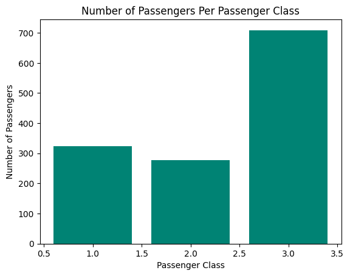
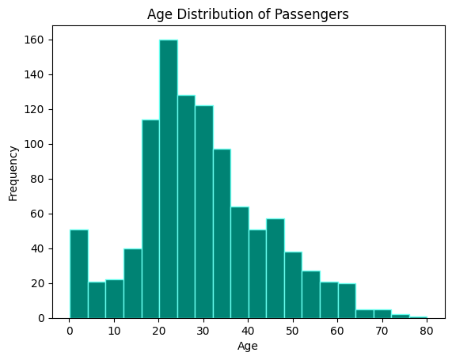
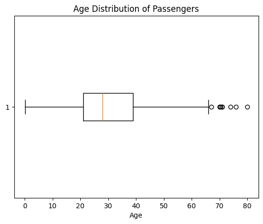
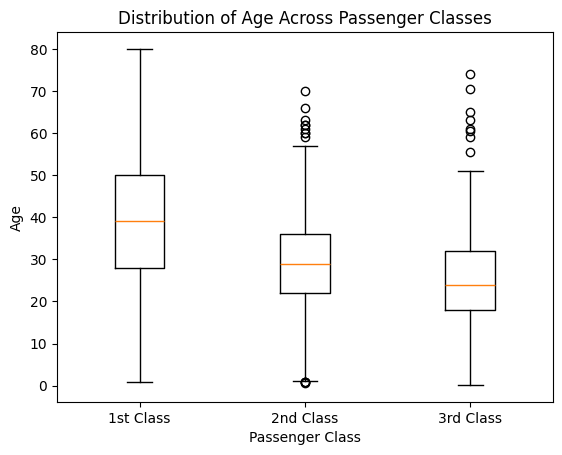
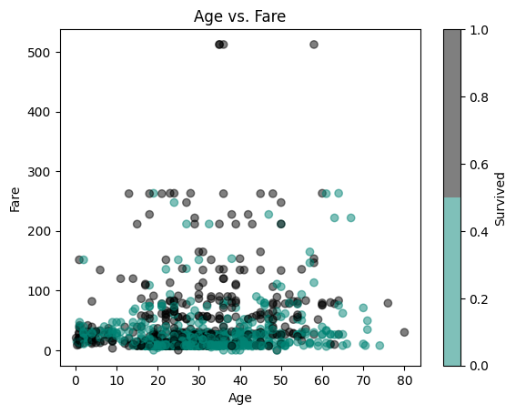
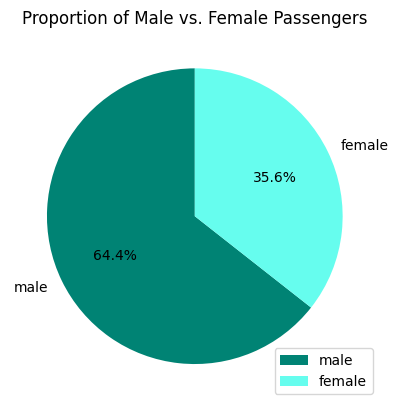
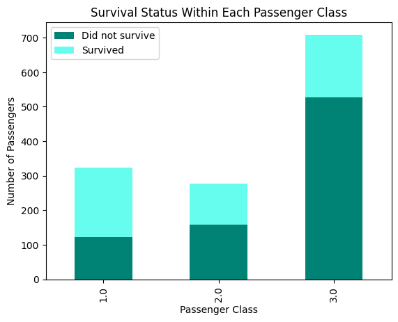
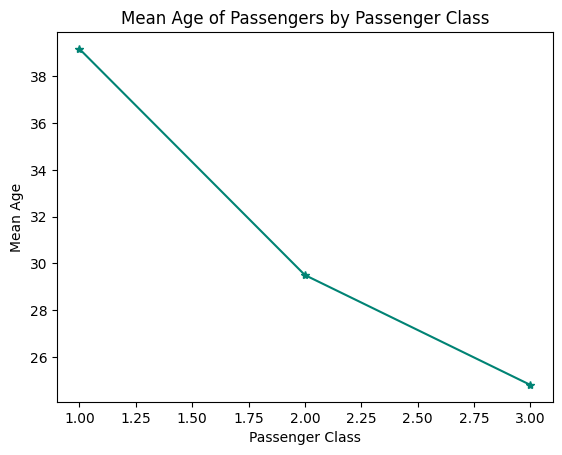
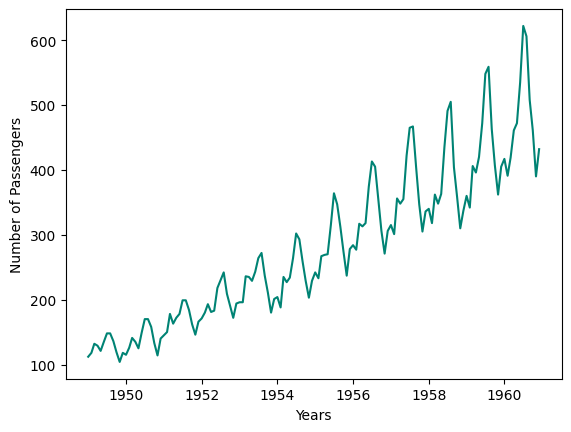

<div class="video-wrapper">
  <iframe
    class="video-iframe"
    src="https://www.youtube.com/embed/QEPAD0ltoeQ?si=gUwDNw_dDKZIr-JZ"
    title="YouTube video player"
    frameborder="0"
    allow="accelerometer; autoplay; clipboard-write; encrypted-media; gyroscope; picture-in-picture;"
    allowfullscreen>
  </iframe>
</div>

## What is Matploblib

Matplotlib is a powerful plotting library in Python commonly used for data visualization. 

When working with datasets, you can use Matplotlib to create various plots to explore and visualize the data. 

Here are some major plots you can create using Matplotlib with the Titanic dataset:

<!-- Newsletter -->
<div class="newsletter">
<div class="newsletter-heading">
<h4><i class="bi bi-info-circle-fill"></i> Don't Miss Any Updates!</h4>
</div>
<div class="newsletter-body">
<p>
Before we continue, we have a humble request, to be among the first to hear about future updates of the course materials, simply enter your email below, follow us on <a href="https://x.com/dataideaorg"><i class="bi bi-twitter-x"></i>
(formally Twitter)</a>, or subscribe to our <a href="https://www.youtube.com/@dataidea-science"><i class="bi bi-youtube"></i> YouTube channel</a>.
</p>
<iframe class="newsletter-frame" src="https://embeds.beehiiv.com/5fc7c425-9c7e-4e08-a514-ad6c22beee74?slim=true" data-test-id="beehiiv-embed" height="52" frameborder="0" scrolling="no">
</iframe>
</div>
</div>


```python
# # Uncomment and run this cell to install the libraries
# !pip install pandas matplotlib dataidea
```


```python
# import the libraries, packages and modules
import pandas as pd
import matplotlib.pyplot as plt
from matplotlib.colors import ListedColormap
from dataidea.datasets import loadDataset
```

Let's demonstrate each of the plots using the Titanic dataset. 
We'll first load the dataset and then create each plot using Matplotlib.


```python
# Load the Titanic dataset
titanic_df = loadDataset('titanic')
```

We can load this dataset like this because it is inbuilt in the dataidea package


```python
titanic_df.head(n=5)
```


<div>
<style scoped>
    .dataframe tbody tr th:only-of-type {
        vertical-align: middle;
    }

    .dataframe tbody tr th {
        vertical-align: top;
    }

    .dataframe thead th {
        text-align: right;
    }
</style>
<table border="1" class="dataframe">
  <thead>
    <tr style="text-align: right;">
      <th></th>
      <th>pclass</th>
      <th>survived</th>
      <th>name</th>
      <th>sex</th>
      <th>age</th>
      <th>sibsp</th>
      <th>parch</th>
      <th>ticket</th>
      <th>fare</th>
      <th>cabin</th>
      <th>embarked</th>
      <th>boat</th>
      <th>body</th>
      <th>home.dest</th>
    </tr>
  </thead>
  <tbody>
    <tr>
      <th>0</th>
      <td>1.0</td>
      <td>1.0</td>
      <td>Allen, Miss. Elisabeth Walton</td>
      <td>female</td>
      <td>29.0000</td>
      <td>0.0</td>
      <td>0.0</td>
      <td>24160</td>
      <td>211.3375</td>
      <td>B5</td>
      <td>S</td>
      <td>2</td>
      <td>NaN</td>
      <td>St Louis, MO</td>
    </tr>
    <tr>
      <th>1</th>
      <td>1.0</td>
      <td>1.0</td>
      <td>Allison, Master. Hudson Trevor</td>
      <td>male</td>
      <td>0.9167</td>
      <td>1.0</td>
      <td>2.0</td>
      <td>113781</td>
      <td>151.5500</td>
      <td>C22 C26</td>
      <td>S</td>
      <td>11</td>
      <td>NaN</td>
      <td>Montreal, PQ / Chesterville, ON</td>
    </tr>
    <tr>
      <th>2</th>
      <td>1.0</td>
      <td>0.0</td>
      <td>Allison, Miss. Helen Loraine</td>
      <td>female</td>
      <td>2.0000</td>
      <td>1.0</td>
      <td>2.0</td>
      <td>113781</td>
      <td>151.5500</td>
      <td>C22 C26</td>
      <td>S</td>
      <td>NaN</td>
      <td>NaN</td>
      <td>Montreal, PQ / Chesterville, ON</td>
    </tr>
    <tr>
      <th>3</th>
      <td>1.0</td>
      <td>0.0</td>
      <td>Allison, Mr. Hudson Joshua Creighton</td>
      <td>male</td>
      <td>30.0000</td>
      <td>1.0</td>
      <td>2.0</td>
      <td>113781</td>
      <td>151.5500</td>
      <td>C22 C26</td>
      <td>S</td>
      <td>NaN</td>
      <td>135.0</td>
      <td>Montreal, PQ / Chesterville, ON</td>
    </tr>
    <tr>
      <th>4</th>
      <td>1.0</td>
      <td>0.0</td>
      <td>Allison, Mrs. Hudson J C (Bessie Waldo Daniels)</td>
      <td>female</td>
      <td>25.0000</td>
      <td>1.0</td>
      <td>2.0</td>
      <td>113781</td>
      <td>151.5500</td>
      <td>C22 C26</td>
      <td>S</td>
      <td>NaN</td>
      <td>NaN</td>
      <td>Montreal, PQ / Chesterville, ON</td>
    </tr>
  </tbody>
</table>
</div>


1. **Bar Plot**: You can create a bar plot to visualize categorical data such as the number of passengers in each class (first class, second class, third class), the number of survivors vs. non-survivors, or the number of passengers embarked from each port (Cherbourg, Queenstown, Southampton).


```python
# 1. Bar Plot - Number of passengers in each class
class_counts = titanic_df.pclass.value_counts()
classes = class_counts.index
counts = class_counts.values

plt.bar(x=classes, height=counts, color='#008374')
plt.title('Number of Passengers Per Passenger Class')
plt.xlabel('Passenger Class')
plt.ylabel('Number of Passengers')

plt.show()
```


    

    


It's easy to see from the graph that the 3rd class had the largest number of passengers, followed by the 1st class and 2nd class comes last

2. **Histogram**: Histograms are useful for visualizing the distribution of continuous variables such as age or fare. You can create histograms to see the age distribution of passengers or the fare distribution.


```python
# 2. Histogram - Age distribution of passengers
ages = titanic_df.age
plt.hist(x=ages, bins=20, color='#008374', 
         edgecolor='#66FDEE')
plt.title('Age Distribution of Passengers')
plt.ylabel('Frequency')
plt.xlabel('Age')
plt.show()
```


    

    


From the histogram we can observe that:

<ul class="cursored-list">
<li><i class="bi bi-cursor"></i> The majority of the people we of ages between 15 and 35</li> 
<li><i class="bi bi-cursor"></i> Fewer older people(above 60 years) boarded the titanic (below 20)t</li> 
</ul>

3. **Box Plot**: A box plot can be used to show the distribution of a continuous variable across different categories. For example, you can create a box plot to visualize the distribution of age or fare across different passenger classes.

3.1. **Age distribution boxplot**


```python
# 3.1 Age distribution boxplot
ages = titanic_df.age.dropna()
plt.boxplot(x=ages, vert=False,)
plt.title('Age Distribution of Passengers')
plt.xlabel('Age')
plt.show()
```


    

    


Features of a box plot:

<i class="bi bi-cursor"></i> **Box**: The box in a boxplot represents the interquartile range (IQR), which contains the middle 50% of the data. The top and bottom edges of the box are the third quartile (Q3) and the first quartile (Q1), respectively.

<i class="bi bi-cursor"></i> **Median Line**: A line inside the box indicates the median (Q2) of the data, which is the middle value of the dataset.

<i class="bi bi-cursor"></i> **Whiskers**: The whiskers extend from the edges of the box to the smallest and largest values within 1.5 times the IQR from Q1 and Q3. They represent the range of the bulk of the data.

<i class="bi bi-cursor"></i> **Outliers**: Data points that fall outside the whiskers are considered outliers. They are typically plotted as individual points. Outliers can be indicative of variability or errors in the data.

<i class="bi bi-cursor"></i> **Minimum and Maximum**: The ends of the whiskers show the minimum and maximum values within the range of 1.5 times the IQR from the first and third quartiles.

**Meaning**: A boxplot provides a visual summary of several important aspects of a dataset:

- **Central Tendency**: The median line shows the central point of the data.
- **Spread**: The IQR (the length of the box) shows the spread of the middle 50% of the data.
- **Symmetry and Skewness**: The relative position of the median within the box and the length of the whiskers can indicate whether the data is symmetric or skewed.
- **Outliers**: Individual points outside the whiskers highlight potential outliers.

Boxplots are particularly useful for comparing distributions between several groups or datasets and identifying outliers and potential anomalies.

**3.2 Age Distribution Across Passenger Classes**


```python
# 3. Box Plot - Distribution of age across passenger classes
plt.boxplot([titanic_df[titanic_df['pclass'] == 1]['age'].dropna(),
             titanic_df[titanic_df['pclass'] == 2]['age'].dropna(),
             titanic_df[titanic_df['pclass'] == 3]['age'].dropna()],
            labels=['1st Class', '2nd Class', '3rd Class'])
plt.xlabel('Passenger Class')
plt.ylabel('Age')
plt.title('Distribution of Age Across Passenger Classes')
plt.show()
```

    /tmp/ipykernel_16695/4289029800.py:2: MatplotlibDeprecationWarning: The 'labels' parameter of boxplot() has been renamed 'tick_labels' since Matplotlib 3.9; support for the old name will be dropped in 3.11.
      plt.boxplot([titanic_df[titanic_df['pclass'] == 1]['age'].dropna(),


    

    


4. **Scatter Plot**: Scatter plots are helpful for visualizing the relationship between two continuous variables. You can create scatter plots to explore relationships such as age vs. fare. Read more about the scatter plot from [the Matplotlib documentation](https://matplotlib.org/stable/api/_as_gen/matplotlib.pyplot.scatter.html)


```python
# 4. Scatter Plot - Age vs. Fare
plt.scatter(
    x=titanic_df['age'], 
    y=titanic_df['fare'], 
    alpha=.5, 
    c=titanic_df['survived'], 
    cmap=ListedColormap(['#008374', '#000000'])
)
plt.xlabel('Age')
plt.ylabel('Fare')
plt.title('Age vs. Fare')
plt.colorbar(label='Survived')  
plt.show()
```


    

    


I don't about you but for me I don't see a linear relationship between the age and fare of the titanic passengers


5. **Pie Chart**: Pie charts can be used to visualize the proportion of different categories within a dataset. For example, you can create a pie chart to show the proportion of male vs. female passengers or the proportion of survivors vs. non-survivors.


```python
# 5. Pie Chart - Proportion of male vs. female passengers
gender_counts = titanic_df['sex'].value_counts()
plt.pie(x=gender_counts, labels=gender_counts.index, 
        autopct='%1.1f%%', startangle=90, 
        colors=['#008374', '#66FDEE'])
plt.title('Proportion of Male vs. Female Passengers')
plt.legend(loc='lower right')
plt.show()
```


    

    


6. **Stacked Bar Plot**: Stacked bar plots can be used to compare the composition of different categories across groups. For example, you can create a stacked bar plot to compare the proportion of survivors and non-survivors within each passenger class.


```python
# 6. Stacked Bar Plot - Survival status within each passenger class
survival_counts = titanic_df.groupby(['pclass', 'survived']).size().unstack()
survival_counts.plot(kind='bar', stacked=True,  
                     color=['#008374', '#66FDEE'])
plt.xlabel('Passenger Class')
plt.ylabel('Number of Passengers')
plt.title('Survival Status Within Each Passenger Class')
plt.legend(['Did not survive', 'Survived'])
plt.show()
```


    

    


```python
titanic_df.groupby(['pclass', 'survived']).size().unstack()
```


<div>
<style scoped>
    .dataframe tbody tr th:only-of-type {
        vertical-align: middle;
    }

    .dataframe tbody tr th {
        vertical-align: top;
    }

    .dataframe thead th {
        text-align: right;
    }
</style>
<table border="1" class="dataframe">
  <thead>
    <tr style="text-align: right;">
      <th>survived</th>
      <th>0.0</th>
      <th>1.0</th>
    </tr>
    <tr>
      <th>pclass</th>
      <th></th>
      <th></th>
    </tr>
  </thead>
  <tbody>
    <tr>
      <th>1.0</th>
      <td>123</td>
      <td>200</td>
    </tr>
    <tr>
      <th>2.0</th>
      <td>158</td>
      <td>119</td>
    </tr>
    <tr>
      <th>3.0</th>
      <td>528</td>
      <td>181</td>
    </tr>
  </tbody>
</table>
</div>


We observe that:

<ul class="cursored-list">
<li><i class="bi bi-cursor"></i> More passengers in class 1 survived than those that did not survive (200 vs 123)</li> 
<li><i class="bi bi-cursor"></i> Most of the passengers in class 3 did not survive (528 vs 181)</li> 
<li><i class="bi bi-cursor"></i> Slightly more passengers did not survive as compared to those that survived in class 2 (152 vs 119)</li> 
</ul>


7. **Line Plot**: Line plots can be useful for visualizing trends over time or continuous variables. While the Titanic dataset may not have explicit time data, you can still use line plots to visualize trends such as the change in survival rate with increasing age or fare.


```python
# 7. Line Plot - Mean age of passengers by passenger class
mean_age_by_class = titanic_df.groupby('pclass')['age'].mean()
plt.plot(mean_age_by_class.index, mean_age_by_class.values, 
         marker='*', color='#008374')
plt.xlabel('Passenger Class')
plt.ylabel('Mean Age')
plt.title('Mean Age of Passengers by Passenger Class')
plt.show()
```


    

    


We can quickly see the average ages for each passenger class, ie:

<ul class="cursored-list">
<li><i class="bi bi-cursor"></i> Around 39 for first class</li> 
<li><i class="bi bi-cursor"></i> Around 30 for second class</li> 
<li><i class="bi bi-cursor"></i> Around 25 for third class</li> 
</ul>

These are some of the major plots you can create using Matplotlib. Each plot serves a different purpose and can help you gain insights into the data and explore relationships between variables.


```python
air_passengers_data = loadDataset('air_passengers')
air_passengers_data.head()
```


<div>
<style scoped>
    .dataframe tbody tr th:only-of-type {
        vertical-align: middle;
    }

    .dataframe tbody tr th {
        vertical-align: top;
    }

    .dataframe thead th {
        text-align: right;
    }
</style>
<table border="1" class="dataframe">
  <thead>
    <tr style="text-align: right;">
      <th></th>
      <th>Month</th>
      <th>Passengers</th>
    </tr>
  </thead>
  <tbody>
    <tr>
      <th>0</th>
      <td>1949-01</td>
      <td>112</td>
    </tr>
    <tr>
      <th>1</th>
      <td>1949-02</td>
      <td>118</td>
    </tr>
    <tr>
      <th>2</th>
      <td>1949-03</td>
      <td>132</td>
    </tr>
    <tr>
      <th>3</th>
      <td>1949-04</td>
      <td>129</td>
    </tr>
    <tr>
      <th>4</th>
      <td>1949-05</td>
      <td>121</td>
    </tr>
  </tbody>
</table>
</div>


```python
air_passengers_data['Month'] = pd.to_datetime(air_passengers_data.Month)
plt.plot('Month', 'Passengers', data=air_passengers_data, color='#008374')
plt.xlabel('Years')
plt.ylabel('Number of Passengers')
plt.show()
```


    

    


We can observe that the number of passengers seems to increase with time

## Review

Congratulations on reaching the end of this tutorial. In this tutorial, we have learned the basic graphs and how to interprete them. ie

<ul class="cursored-list">
<li><i class="bi bi-cursor"></i> Bar chart</li> 
<li><i class="bi bi-cursor"></i> Histogram</li> 
<li><i class="bi bi-cursor"></i> Scatter plot</li> 
<li><i class="bi bi-cursor"></i> Line plot</li> 
<li><i class="bi bi-cursor"></i> Box plot</li> 
<li><i class="bi bi-cursor"></i> Pie chart</li> 
<li><i class="bi bi-cursor"></i> Stacked bar chart</li> 
</ul>

<h2>What's on your mind? Put it in the comments!</h2>
<script src="https://utteranc.es/client.js"
        repo="dataideaorg/dataidea-science"
        issue-term="pathname"
        theme="github-light"
        crossorigin="anonymous"
        async>
</script>
