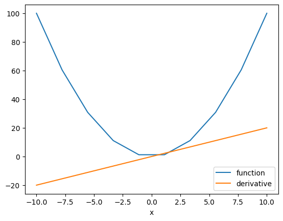
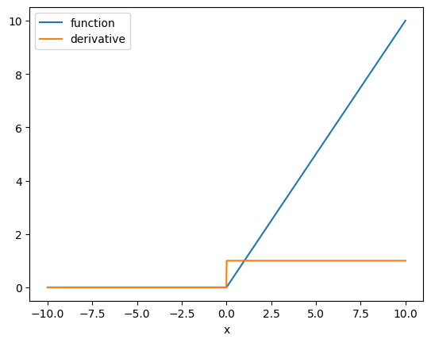

<h2>Objective</h2><ul><li> How to perform differentiation in pytorch.</li></ul> 


<h2>Table of Contents</h2>

<p>In this lab, you will learn the basics of differentiation.</p> 

<ul>
    <li><a href="#Derivative">Derivatives</a></li>
    <li><a href="#Partial_Derivative">Partial Derivatives</a></li>
</ul>

<p>Estimated Time Needed: <strong>25 min</strong></p>
<hr>


<!-- Newsletter -->
<div class="newsletter">
<div class="newsletter-heading">
<h4><i class="bi bi-info-circle-fill"></i> Don't Miss Any Updates!</h4>
</div>
<div class="newsletter-body">
<p>
Before we continue, I have a humble request, to be among the first to hear about future updates of the course materials, simply enter your email below, follow us on <a href="https://x.com/dataideaorg"><i class="bi bi-twitter-x"></i>
(formally Twitter)</a>, or subscribe to our <a href="https://www.youtube.com/@dataidea-science"><i class="bi bi-youtube"></i> YouTube channel</a>.
</p>
<iframe class="newsletter-frame" src="https://embeds.beehiiv.com/5fc7c425-9c7e-4e08-a514-ad6c22beee74?slim=true" data-test-id="beehiiv-embed" height="52" frameborder="0" scrolling="no">
</iframe>
</div>
</div>

<h2>Preparation</h2>


The following are the libraries we are going to use for this lab.


```python
# These are the libraries will be useing for this lab.

import torch 
import matplotlib.pylab as plt

```

<h2 id="Derivative">Derivatives</h2>


Let us create the tensor <code>x</code> and set the parameter <code>requires_grad</code> to true because you are going to take the derivative of the tensor.


```python
# Create a tensor x

x = torch.tensor(2.0, requires_grad = True)
print("The tensor x: ", x)
```

    The tensor x:  tensor(2., requires_grad=True)


Then let us create a tensor according to the equation $y=x^2$.


```python
# Create a tensor y according to y = x^2

y = x ** 2
print("The result of y = x^2: ", y)
```

    The result of y = x^2:  tensor(4., grad_fn=<PowBackward0>)


Then let us take the derivative with respect x at x = 2


```python
# Take the derivative. Try to print out the derivative at the value x = 2

y.backward()
print("The dervative at x = 2: ", x.grad)
```

    The dervative at x = 2:  tensor(4.)


The preceding lines perform the following operation: 


$\frac{\mathrm{dy(x)}}{\mathrm{dx}}=2x$


$\frac{\mathrm{dy(x=2)}}{\mathrm{dx}}=2(2)=4$


```python
print('data:',x.data)
print('grad_fn:',x.grad_fn)
print('grad:',x.grad)
print("is_leaf:",x.is_leaf)
print("requires_grad:",x.requires_grad)
```

    data: tensor(2.)
    grad_fn: None
    grad: tensor(4.)
    is_leaf: True
    requires_grad: True


```python
print('data:',y.data)
print('grad_fn:',y.grad_fn)
print('grad:',y.grad)
print("is_leaf:",y.is_leaf)
print("requires_grad:",y.requires_grad)
```

    data: tensor(4.)
    grad_fn: <PowBackward0 object at 0x7873c29f8070>
    grad: None
    is_leaf: False
    requires_grad: True


    /tmp/ipykernel_17856/1355624623.py:3: UserWarning: The .grad attribute of a Tensor that is not a leaf Tensor is being accessed. Its .grad attribute won't be populated during autograd.backward(). If you indeed want the .grad field to be populated for a non-leaf Tensor, use .retain_grad() on the non-leaf Tensor. If you access the non-leaf Tensor by mistake, make sure you access the leaf Tensor instead. See github.com/pytorch/pytorch/pull/30531 for more informations. (Triggered internally at aten/src/ATen/core/TensorBody.h:489.)
      print('grad:',y.grad)


Let us try to calculate the derivative for a more complicated function. 


```python
# Calculate the y = x^2 + 2x + 1, then find the derivative 

x = torch.tensor(2.0, requires_grad = True)
y = x ** 2 + 2 * x + 1
print("The result of y = x^2 + 2x + 1: ", y)
y.backward()
print("The dervative at x = 2: ", x.grad)
```

    The result of y = x^2 + 2x + 1:  tensor(9., grad_fn=<AddBackward0>)
    The dervative at x = 2:  tensor(6.)


The function is in the following form:
$y=x^{2}+2x+1$


The derivative is given by:


$\frac{\mathrm{dy(x)}}{\mathrm{dx}}=2x+2$

$\frac{\mathrm{dy(x=2)}}{\mathrm{dx}}=2(2)+2=6$


<!--Empty Space for separating topics-->


<h3>Practice</h3>


Determine the derivative of $y = 2x^3+x$ at $x=1$


```python
# Practice: Calculate the derivative of y = 2x^3 + x at x = 1

# Type your code here
```

Double-click <b>here</b> for the solution.
<!-- 
x = torch.tensor(1.0, requires_grad=True)
y = 2 * x ** 3 + x
y.backward()
print("The derivative result: ", x.grad)
 -->


<!--Empty Space for separating topics-->


 We can implement our own custom autograd Functions by subclassing
    torch.autograd.Function and implementing the forward and backward passes
    which operate on Tensors


```python
class SQ(torch.autograd.Function):


    @staticmethod
    def forward(ctx,i):
        """
        In the forward pass we receive a Tensor containing the input and return
        a Tensor containing the output. ctx is a context object that can be used
        to stash information for backward computation. You can cache arbitrary
        objects for use in the backward pass using the ctx.save_for_backward method.
        """
        result=i**2
        ctx.save_for_backward(i)
        return result

    @staticmethod
    def backward(ctx, grad_output):
        """
        In the backward pass we receive a Tensor containing the gradient of the loss
        with respect to the output, and we need to compute the gradient of the loss
        with respect to the input.
        """
        i, = ctx.saved_tensors
        grad_output = 2*i
        return grad_output
```

We can apply it the function  


```python
x=torch.tensor(2.0,requires_grad=True )
sq=SQ.apply

y=sq(x)
y
print(y.grad_fn)
y.backward()
x.grad
```

    <torch.autograd.function.SQBackward object at 0x7873c29c7df0>


    tensor(4.)


<h2 id="Partial_Derivative">Partial Derivatives</h2>


We can also calculate <b>Partial Derivatives</b>. Consider the function: $f(u,v)=vu+u^{2}$


Let us create <code>u</code> tensor, <code>v</code> tensor and  <code>f</code> tensor


```python
# Calculate f(u, v) = v * u + u^2 at u = 1, v = 2

u = torch.tensor(1.0,requires_grad=True)
v = torch.tensor(2.0,requires_grad=True)
f = u * v + u ** 2
print("The result of v * u + u^2: ", f)
```

    The result of v * u + u^2:  tensor(3., grad_fn=<AddBackward0>)


This is equivalent to the following: 


$f(u=1,v=2)=(2)(1)+1^{2}=3$


<!--Empty Space for separating topics-->


Now let us take the derivative with respect to <code>u</code>:


```python
# Calculate the derivative with respect to u

f.backward()
print("The partial derivative with respect to u: ", u.grad)
```

    The partial derivative with respect to u:  tensor(4.)


the expression is given by:


$\frac{\mathrm{\partial f(u,v)}}{\partial {u}}=v+2u$

$\frac{\mathrm{\partial f(u=1,v=2)}}{\partial {u}}=2+2(1)=4$


<!--Empty Space for separating topics-->


Now, take the derivative with respect to <code>v</code>:


```python
# Calculate the derivative with respect to v

print("The partial derivative with respect to u: ", v.grad)
```

    The partial derivative with respect to u:  tensor(1.)


The equation is given by:


$\frac{\mathrm{\partial f(u,v)}}{\partial {v}}=u$

$\frac{\mathrm{\partial f(u=1,v=2)}}{\partial {v}}=1$


<!--Empty Space for separating topics-->


Calculate the derivative with respect to a function with multiple values as follows. You use the sum trick to produce a scalar valued function and then take the gradient: 


```python
# Calculate the derivative with multiple values

x = torch.linspace(-10, 10, 10, requires_grad = True)
Y = x ** 2
y = torch.sum(x ** 2)
```

We can plot the function  and its derivative 


```python
# Take the derivative with respect to multiple value. Plot out the function and its derivative

y.backward()

plt.plot(x.detach().numpy(), Y.detach().numpy(), label = 'function')
plt.plot(x.detach().numpy(), x.grad.detach().numpy(), label = 'derivative')
plt.xlabel('x')
plt.legend()
plt.show()
```


    

    


The orange line is the slope of the blue line at the intersection point, which is the derivative of the blue line.


The  method <code> detach()</code>  excludes further tracking of operations in the graph, and therefore the subgraph will not record operations. This allows us to then convert the tensor to a numpy array. To understand the sum operation  <a href="https://pytorch.org/tutorials/beginner/blitz/autograd_tutorial.html?utm_medium=Exinfluencer&utm_source=Exinfluencer&utm_content=000026UJ&utm_term=10006555&utm_id=NA-SkillsNetwork-Channel-SkillsNetworkCoursesIBMDeveloperSkillsNetworkDL0110ENSkillsNetwork952-2022-01-01">Click Here</a>


<!--Empty Space for separating topics-->


The <b>relu</b> activation function is an essential function in neural networks. We can take the derivative as follows: 


```python
# Take the derivative of Relu with respect to multiple value. Plot out the function and its derivative

x = torch.linspace(-10, 10, 1000, requires_grad = True)
Y = torch.relu(x)
y = Y.sum()
y.backward()
plt.plot(x.detach().numpy(), Y.detach().numpy(), label = 'function')
plt.plot(x.detach().numpy(), x.grad.detach().numpy(), label = 'derivative')
plt.xlabel('x')
plt.legend()
plt.show()
```


    

    


<!--Empty Space for separating topics-->


```python
y.grad_fn
```


    <SumBackward0 at 0x7873545dfc40>


<h3>Practice</h3>


Try to determine partial derivative  $u$ of the following function where $u=2$ and $v=1$: $ f=uv+(uv)^2$


```python
# Practice: Calculate the derivative of f = u * v + (u * v) ** 2 at u = 2, v = 1

# Type the code here
```

<h2>What's on your mind? Put it in the comments!</h2>
<script src="https://utteranc.es/client.js"
        repo="dataideaorg/dataidea-science"
        issue-term="pathname"
        theme="github-light"
        crossorigin="anonymous"
        async>
</script>
