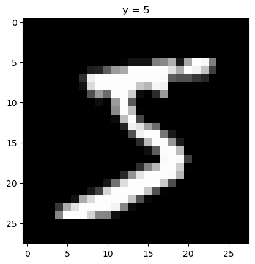

<h1>Prebuilt Datasets and Transforms</h1> 


<h2>Objective</h2><ul><li> How to use MNIST prebuilt dataset in pytorch.</li></ul> 


<h2>Table of Contents</h2>
<p>In this lab, you will use a prebuilt dataset and then use some prebuilt dataset transforms.</p>
<ul>
    <li><a href="#Prebuilt_Dataset">Prebuilt Datasets</a></li>
    <li><a href="#Torchvision">Torchvision Transforms</a></li>
</ul>
<p>Estimated Time Needed: <strong>10 min</strong></p>

<hr>


<h2>Preparation</h2>


The following are the libraries we are going to use for this lab. The <code>torch.manual_seed()</code> is for forcing the random function to give the same number every time we try to recompile it.


```python
# These are the libraries will be used for this lab.

# !pip install torchvision==0.9.1 torch==1.8.1 
import torch 
import matplotlib.pylab as plt
import numpy as np
torch.manual_seed(0)
```

This is the function for displaying images.


```python
# Show data by diagram

def show_data(data_sample, shape = (28, 28)):
    plt.imshow(data_sample[0].numpy().reshape(shape), cmap='gray')
    plt.title('y = ' + str(data_sample[1]))
```

<!--Empty Space for separating topics-->


<h2 id="Prebuilt_Dataset">Prebuilt Datasets</h2> 


You will focus on the following libraries: 


```python
# Run the command below when you do not have torchvision installed
# !mamba install -y torchvision

import torchvision.transforms as transforms
import torchvision.datasets as dsets
```

We can import a prebuilt dataset. In this case, use MNIST. You'll work with several of these parameters later by placing a transform object in the argument <code>transform</code>.


```python
# Import the prebuilt dataset into variable dataset


dataset = dsets.MNIST(
    root = './data',  
    download = True, 
    transform = transforms.ToTensor()
)
```

Each element of the dataset object contains a tuple. Let us see whether the first element in the dataset is a tuple and what is in it.


```python
# Examine whether the elements in dataset MNIST are tuples, and what is in the tuple?

print("Type of the first element: ", type(dataset[0]))
print("The length of the tuple: ", len(dataset[0]))
print("The shape of the first element in the tuple: ", dataset[0][0].shape)
print("The type of the first element in the tuple", type(dataset[0][0]))
print("The second element in the tuple: ", dataset[0][1])
print("The type of the second element in the tuple: ", type(dataset[0][1]))
print("As the result, the structure of the first element in the dataset is (tensor([1, 28, 28]), tensor(7)).")
```

As shown in the output, the first element in the tuple is a cuboid tensor. As you can see, there is a dimension with only size 1, so basically, it is a rectangular tensor.<br>
The second element in the tuple is a number tensor, which indicate the real number the image shows. As the second element in the tuple is <code>tensor(7)</code>, the image should show a hand-written 7.


<!--Empty Space for separating topics-->


Let us plot the first element in the dataset:


```python
# Plot the first element in the dataset

show_data(dataset[0])
```


    

    


As we can see, it is a 7.


Plot the second sample:   


```python
# Plot the second element in the dataset

show_data(dataset[1])
```


    

    


<!--Empty Space for separating topics-->


<h2 id="Torchvision"> Torchvision Transforms  </h2> 


We can apply some image transform functions on the MNIST dataset.


As an example, the images in the MNIST dataset can be cropped and converted to a tensor. We can use <code>transform.Compose</code> we learned from the previous lab to combine the two transform functions.


```python
# Combine two transforms: crop and convert to tensor. Apply the compose to MNIST dataset

croptensor_data_transform = transforms.Compose([transforms.CenterCrop(20), transforms.ToTensor()])
dataset = dsets.MNIST(root = './data', download = True, transform = croptensor_data_transform)
print("The shape of the first element in the first tuple: ", dataset[0][0].shape)
```

    The shape of the first element in the first tuple:  torch.Size([1, 20, 20])


We can see the image is now 20 x 20 instead of 28 x 28.


<!--Empty Space for separating topics-->


Let us plot the first image again. Notice that the black space around the <b>7</b> become less apparent.


```python
# Plot the first element in the dataset

show_data(dataset[0],shape = (20, 20))
```


    

    


```python
# Plot the second element in the dataset

show_data(dataset[1],shape = (20, 20))
```


    

    


In the below example, we horizontally flip the image, and then convert it to a tensor. Use <code>transforms.Compose()</code> to combine these two transform functions. Plot the flipped image.


```python
# Construct the compose. Apply it on MNIST dataset. Plot the image out.

fliptensor_data_transform = transforms.Compose([transforms.RandomHorizontalFlip(p = 1),transforms.ToTensor()])
dataset = dsets.MNIST(root = './data', download = True, transform = fliptensor_data_transform)
# show_data(dataset[1])
```

<!--Empty Space for separating topics-->


<h3>Practice</h3>


Try to use the <code>RandomVerticalFlip</code> (vertically flip the image) with horizontally flip and convert to tensor as a compose. Apply the compose on image. Use <code>show_data()</code> to plot the second image (the image as <b>2</b>).


```python
# Practice: Combine vertical flip, horizontal flip and convert to tensor as a compose. Apply the compose on image. Then plot the image
random_vertical_flip = transforms.Compose([transforms.RandomVerticalFlip(), transforms.ToTensor()])
dataset = dsets.MNIST(root= ".data", download=True, transform=fliptensor_data_transform)
show_data(dataset[0])
# Type your code here
```


    

    

