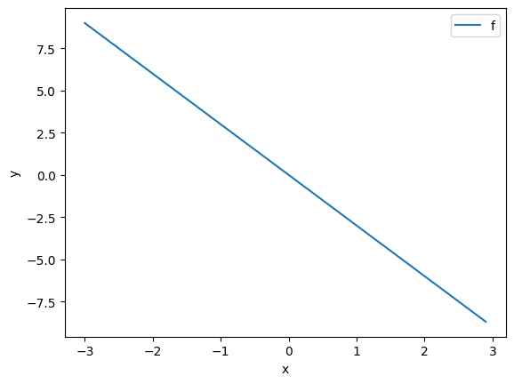
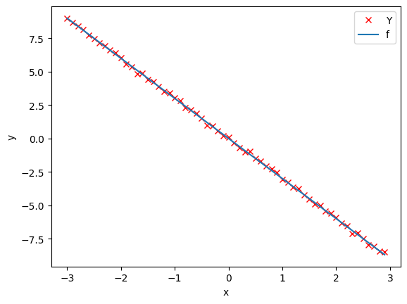
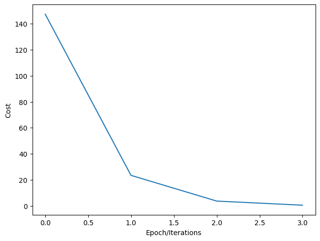

---
title: Linear Regression 1D, Training One Parameter
keywords: []
description: In this lab, you will train a model with PyTorch by using data that you created
author: Juma Shafara
date: "2024-08-05"
--- 


## Linear Regression 1D: Training One Parameter

<h2>Objective</h2><ul><li> How to create cost or criterion function using MSE (Mean Square Error).</li></ul> 

<h2>Table of Contents</h2>
<p>In this lab, you will train a model with PyTorch by using data that you created. The model only has one parameter: the slope.</p>

<ul>
    <li><a href="https://#Makeup_Data">Make Some Data</a></li>
    <li><a href="https://#Model_Cost">Create the Model and Cost Function (Total Loss)</a></li>
    <li><a href="https://#Train">Train the Model</a></li>
</ul>
<p>Estimated Time Needed: <strong>20 min</strong></p>

<hr>


<!-- Newsletter -->
<div class="newsletter">
<div class="newsletter-heading">
<h4><i class="bi bi-info-circle-fill"></i> Don't Miss Any Updates!</h4>
</div>
<div class="newsletter-body">
<p>
Before we continue, I have a humble request, to be among the first to hear about future updates of the course materials, simply enter your email below, follow us on <a href="https://x.com/dataideaorg"><i class="bi bi-twitter-x"></i>
(formally Twitter)</a>, or subscribe to our <a href="https://www.youtube.com/@dataidea-science"><i class="bi bi-youtube"></i> YouTube channel</a>.
</p>
<iframe class="newsletter-frame" src="https://embeds.beehiiv.com/5fc7c425-9c7e-4e08-a514-ad6c22beee74?slim=true" data-test-id="beehiiv-embed" height="52" frameborder="0" scrolling="no">
</iframe>
</div>
</div>

<h2>Preparation</h2>


The following are the libraries we are going to use for this lab.


```python
# These are the libraries will be used for this lab.

import numpy as np
import matplotlib.pyplot as plt

```

The class <code>plot_diagram</code> helps us to visualize the data space and the parameter space during training and has nothing to do with PyTorch.


```python
# The class for plotting

class plot_diagram():
    
    # Constructor
    def __init__(self, X, Y, w, stop, go = False):
        start = w.data
        self.error = []
        self.parameter = []
        self.X = X.numpy()
        self.Y = Y.numpy()
        self.parameter_values = torch.arange(start, stop)
        self.Loss_function = [criterion(forward(X), Y) for w.data in self.parameter_values] 
        w.data = start
        
    # Executor
    def __call__(self, Yhat, w, error, n):
        self.error.append(error)
        self.parameter.append(w.data)
        plt.subplot(212)
        plt.plot(self.X, Yhat.detach().numpy())
        plt.plot(self.X, self.Y,'ro')
        plt.xlabel("A")
        plt.ylim(-20, 20)
        plt.subplot(211)
        plt.title("Data Space (top) Estimated Line (bottom) Iteration " + str(n))
        plt.plot(self.parameter_values.numpy(), self.Loss_function)   
        plt.plot(self.parameter, self.error, 'ro')
        plt.xlabel("B")
        plt.figure()
    
    # Destructor
    def __del__(self):
        plt.close('all')
```

<!--Empty Space for separating topics-->


<h2 id="Makeup_Data">Make Some Data</h2>


Import PyTorch library:


```python
# Import the library PyTorch

import torch
```

Generate values from -3 to 3 that create a line with a slope of -3. This is the line you will estimate.


```python
# Create the f(X) with a slope of -3

X = torch.arange(-3, 3, 0.1).view(-1, 1)
f = -3 * X
```

Let us plot the line.


```python
# Plot the line with blue

plt.plot(X.numpy(), f.numpy(), label = 'f')
plt.xlabel('x')
plt.ylabel('y')
plt.legend()
plt.show()
```


    

    


Let us add some noise to the data in order to simulate the real data. Use <code>torch.randn(X.size())</code> to generate Gaussian noise that is the same size as <code>X</code> and has a standard deviation opf 0.1.


```python
# Add some noise to f(X) and save it in Y

Y = f + 0.1 * torch.randn(X.size())
```

Plot the <code>Y</code>:


```python
# Plot the data points

plt.plot(X.numpy(), Y.numpy(), 'rx', label = 'Y')

plt.plot(X.numpy(), f.numpy(), label = 'f')
plt.xlabel('x')
plt.ylabel('y')
plt.legend()
plt.show()
```


    

    


<!--Empty Space for separating topics-->


<h2 id="Model_Cost">Create the Model and Cost Function (Total Loss)</h2>


In this section, let us create the model and the cost function (total loss) we are going to use to train the model and evaluate the result.


First, define the <code>forward</code> function $y=w*x$. (We will add the bias in the next lab.)


```python
# Create forward function for prediction

def forward(x):
    return w * x
```

Define the cost or criterion function using MSE (Mean Square Error):


```python
# Create the MSE function for evaluate the result.

def criterion(yhat, y):
    return torch.mean((yhat - y) ** 2)
```

Define the learning rate <code>lr</code> and an empty list <code>LOSS</code> to record the loss for each iteration:


```python
# Create Learning Rate and an empty list to record the loss for each iteration

lr = 0.1
LOSS = []
```

Now, we create a model parameter by setting the argument <code>requires_grad</code> to <code> True</code> because the system must learn it.


```python
w = torch.tensor(-10.0, requires_grad = True)
```

Create a <code>plot_diagram</code> object to visualize the data space and the parameter space for each iteration during training:


```python
gradient_plot = plot_diagram(X, Y, w, stop = 5)
```

<!--Empty Space for separating topics-->


<h2 id="Train">Train the Model</h2>


Let us define a function for training the model. The steps will be described in the comments.


```python
# Define a function for train the model

def train_model(iter):
    for epoch in range (iter):
        
        # make the prediction as we learned in the last lab
        Yhat = forward(X)
        
        # calculate the iteration
        loss = criterion(Yhat,Y)
        
        # plot the diagram for us to have a better idea
        # gradient_plot(Yhat, w, loss.item(), epoch)
        
        # store the loss into list
        LOSS.append(loss.item())
        
        # backward pass: compute gradient of the loss with respect to all the learnable parameters
        loss.backward()
        
        # updata parameters
        w.data = w.data - lr * w.grad.data
        
        # zero the gradients before running the backward pass
        w.grad.data.zero_()
```

Let us try to run 4 iterations of gradient descent:


```python
# Give 4 iterations for training the model here.

train_model(4)
```

Plot the cost for each iteration:


```python
# Plot the loss for each iteration

plt.plot(LOSS)
plt.tight_layout()
plt.xlabel("Epoch/Iterations")
plt.ylabel("Cost")
```


    Text(38.347222222222214, 0.5, 'Cost')


    

    


<!--Empty Space for separating topics-->


## About the Author:

Hi, My name is Juma Shafara. Am a Data Scientist and Instructor at DATAIDEA. I have taught hundreds of peope Programming, Data Analysis and Machine Learning. I also enjoy developing innovative algorithms and models that can drive insights and value. I regularly share some content that I find useful throughout my learning/teaching journey to simplify concepts in Machine Learning, Mathematics, Programming, and related topics on my website [jumashafara.dataidea.org](https://jumashafara.dataidea.org). Besides these //technical stuff, I enjoy watching soccer, movies and reading mystery books.


<h2>What's on your mind? Put it in the comments!</h2>
<script src="https://utteranc.es/client.js"
        repo="dataideaorg/dataidea-science"
        issue-term="pathname"
        theme="github-light"
        crossorigin="anonymous"
        async>
</script>
