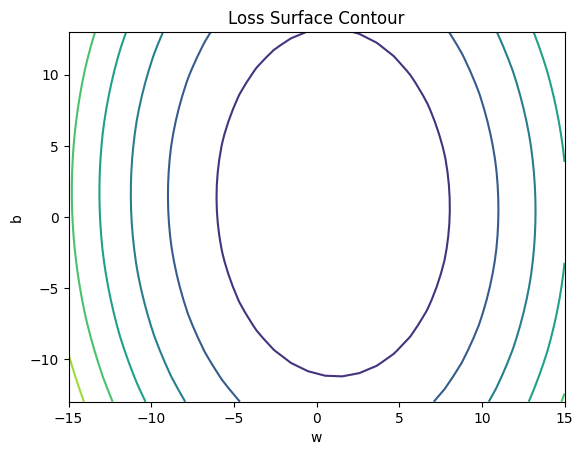
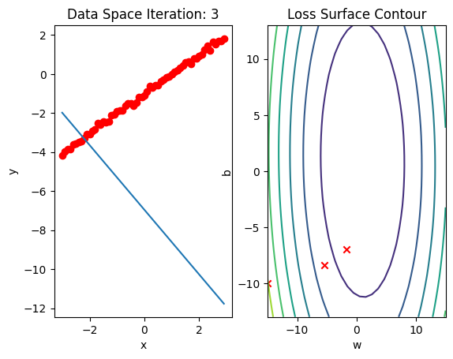

<h2>Linear Regression 1D: Training Two Parameter Mini-Batch Gradient Decent</h2>


<h2>Objective</h2><ul class="cursored-list"><li><i class="bi bi-cursor"></i> How to use Mini-Batch Gradient Descent to train model.</li></ul>


<h2>Table of Contents</h2>
<p>In this Lab, you will practice training a model by using Mini-Batch Gradient Descent.</p>

<ul class="cursored-list">
    <li><a href="#Makeup_Data"><i class="bi bi-cursor"></i> Make Some Data</a></li>
    <li><a href="#Model_Cost"><i class="bi bi-cursor"></i> Create the Model and Cost Function (Total Loss)</a></li>
    <li><a href="#BGD"><i class="bi bi-cursor"></i> Train the Model: Batch Gradient Descent</a></li>
    <li><a href="#SGD"><i class="bi bi-cursor"></i> Train the Model: Stochastic Gradient Descent with Dataset DataLoader</a></li>
    <li><a href="#Mini5"><i class="bi bi-cursor"></i> Train the Model: Mini Batch Gradient Decent: Batch Size Equals 5</a></li>
    <li><a href="#Mini10"><i class="bi bi-cursor"></i> Train the Model: Mini Batch Gradient Decent: Batch Size Equals 10</a></li>
</ul>
<p>Estimated Time Needed: <strong>30 min</strong></p>

<hr>


<!-- Newsletter -->
<div class="newsletter">
<div class="newsletter-heading">
<h4><i class="bi bi-info-circle-fill"></i> Don't Miss Any Updates!</h4>
</div>
<div class="newsletter-body">
<p>
Before we continue, I have a humble request, to be among the first to hear about future updates of the course materials, simply enter your email below, follow us on <a href="https://x.com/dataideaorg"><i class="bi bi-twitter-x"></i>
(formally Twitter)</a>, or subscribe to our <a href="https://www.youtube.com/@dataidea-science"><i class="bi bi-youtube"></i> YouTube channel</a>.
</p>
<iframe class="newsletter-frame" src="https://embeds.beehiiv.com/5fc7c425-9c7e-4e08-a514-ad6c22beee74?slim=true" data-test-id="beehiiv-embed" height="52" frameborder="0" scrolling="no">
</iframe>
</div>
</div>

## Preparation

We'll need the following libraries:


```python
# Import the libraries we need for this lab

import numpy as np
import matplotlib.pyplot as plt
from mpl_toolkits import mplot3d
from dataidea_science.plots import plot_error_surfaces
```

The class <code>plot_error_surfaces</code> is just to help you visualize the data space and the parameter space during training and has nothing to do with PyTorch.


<!--Empty Space for separating topics-->


<h2 id="Makeup_Data">Make Some Data </h2>


Import PyTorch and set random seed:


```python
# Import PyTorch library

import torch
torch.manual_seed(1)
```


    <torch._C.Generator at 0x7dc5dfe66290>


Generate values from -3 to 3 that create a line with a slope of 1 and a bias of -1. This is the line that you need to estimate. Add some noise to the data:


```python
# Generate the data with noise and the line

X = torch.arange(-3, 3, 0.1).view(-1, 1)
f = 1 * X - 1
Y = f + 0.1 * torch.randn(X.size())
```

Plot the results:


```python
# Plot the line and the data

plt.plot(X.numpy(), Y.numpy(), 'o', label = 'y', c='g')
plt.plot(X.numpy(), f.numpy(), label = 'f', c='b')
plt.xlabel('x')
plt.ylabel('y')
plt.legend()
plt.show()
```


    

    


<!--Empty Space for separating topics-->


<h2 id="Model_Cost">Create the Model and Cost Function (Total Loss) </h2>


Define the <code>forward</code> function:


```python
# Define the prediction function

def forward(x):
    return w * x + b
```

Define the cost or criterion function:


```python
# Define the cost function

def criterion(yhat, y):
    return torch.mean((yhat - y) ** 2)
```

Create a <code> plot_error_surfaces</code> object to visualize the data space and the parameter space during training:


```python
# Create a plot_error_surfaces object.

get_surface = plot_error_surfaces(15, 13, X, Y, 30)
```


    <Figure size 640x480 with 0 Axes>


    

    


    

    


<!--Empty Space for separating topics-->


<h2>Train the Model: Batch Gradient Descent (BGD)</h2>


Define <code>train_model_BGD</code> function.


```python
# Define the function for training model

w = torch.tensor(-15.0, requires_grad = True)
b = torch.tensor(-10.0, requires_grad = True)
lr = 0.1
LOSS_BGD = []

def train_model_BGD(epochs):
    for epoch in range(epochs):
        Yhat = forward(X)
        loss = criterion(Yhat, Y)
        LOSS_BGD.append(loss)
        get_surface.set_para_loss(w.data.tolist(), b.data.tolist(), loss.tolist())
        get_surface.plot_ps()
        loss.backward()
        w.data = w.data - lr * w.grad.data
        b.data = b.data - lr * b.grad.data
        w.grad.data.zero_()
        b.grad.data.zero_()
```

Run 10 epochs of batch gradient descent: <b>bug</b> data space is 1 iteration ahead of parameter space.


```python
# Run train_model_BGD with 10 iterations

train_model_BGD(10)
```


    

    


    

    


    

    


    

    


    

    


    

    


    

    


    

    


    

    


    

    


<!--Empty Space for separating topics-->


<h2 id="SGD"> Stochastic Gradient Descent (SGD) with Dataset DataLoader</h2>


Create a <code>plot_error_surfaces</code> object to visualize the data space and the parameter space during training:


```python
# Create a plot_error_surfaces object.

get_surface = plot_error_surfaces(15, 13, X, Y, 30, go = False)
```

Import <code>Dataset</code> and <code>DataLoader</code> libraries


```python
# Import libraries

from torch.utils.data import Dataset, DataLoader
```

Create <code>Data</code> class


```python
# Create class Data

class Data(Dataset):
    
    # Constructor
    def __init__(self):
        self.x = torch.arange(-3, 3, 0.1).view(-1, 1)
        self.y = 1 * X - 1
        self.len = self.x.shape[0]
        
    # Getter
    def __getitem__(self, index):    
        return self.x[index], self.y[index]
    
    # Get length
    def __len__(self):
        return self.len
```

Create a dataset object and a dataloader object:


```python
# Create Data object and DataLoader object

dataset = Data()
trainloader = DataLoader(dataset = dataset, batch_size = 1)
```

Define <code>train_model_SGD</code> function for training the model.


```python
# Define train_model_SGD function

w = torch.tensor(-15.0, requires_grad = True)
b = torch.tensor(-10.0, requires_grad = True)
LOSS_SGD = []
lr = 0.1
def train_model_SGD(epochs):
    for epoch in range(epochs):
        Yhat = forward(X)
        get_surface.set_para_loss(w.data.tolist(), b.data.tolist(), criterion(Yhat, Y).tolist())
        get_surface.plot_ps()
        LOSS_SGD.append(criterion(forward(X), Y).tolist())
        for x, y in trainloader:
            yhat = forward(x)
            loss = criterion(yhat, y)
            get_surface.set_para_loss(w.data.tolist(), b.data.tolist(), loss.tolist())
            loss.backward()
            w.data = w.data - lr * w.grad.data
            b.data = b.data - lr * b.grad.data
            w.grad.data.zero_()
            b.grad.data.zero_()
        get_surface.plot_ps()
```

Run 10 epochs of stochastic gradient descent: <b>bug</b> data space is 1 iteration ahead of parameter space.


```python
# Run train_model_SGD(iter) with 10 iterations

train_model_SGD(10)
```


    

    


    

    


    

    


    

    


    

    


    

    


    

    


    

    


    

    


    

    


    

    


    

    


    

    


    

    


    

    


    

    


    

    


    

    


    

    


    

    


<!--Empty Space for separating topics-->


<h2 id="Mini5">Mini Batch Gradient Descent: Batch Size Equals 5</h2>


Create a <code> plot_error_surfaces</code> object to visualize the data space and the parameter space during training:


```python
# Create a plot_error_surfaces object.

get_surface = plot_error_surfaces(15, 13, X, Y, 30, go = False)
get_surface
```


    <__main__.plot_error_surfaces at 0x77fc19f16660>


Create <code>Data</code> object and create a <code>Dataloader</code> object where the batch size equals 5:


```python
# Create DataLoader object and Data object

dataset = Data()
trainloader = DataLoader(dataset = dataset, batch_size = 5)
```

Define <code>train_model_Mini5</code> function to train the model.


```python
# Define train_model_Mini5 function

w = torch.tensor(-15.0, requires_grad = True)
b = torch.tensor(-10.0, requires_grad = True)
LOSS_MINI5 = []
lr = 0.1

def train_model_Mini5(epochs):
    for epoch in range(epochs):
        Yhat = forward(X)
        get_surface.set_para_loss(w.data.tolist(), b.data.tolist(), criterion(Yhat, Y).tolist())
        get_surface.plot_ps()
        LOSS_MINI5.append(criterion(forward(X), Y).tolist())
        for x, y in trainloader:
            yhat = forward(x)
            loss = criterion(yhat, y)
            get_surface.set_para_loss(w.data.tolist(), b.data.tolist(), loss.tolist())
            loss.backward()
            w.data = w.data - lr * w.grad.data
            b.data = b.data - lr * b.grad.data
            w.grad.data.zero_()
            b.grad.data.zero_()
```

Run 10 epochs of mini-batch gradient descent: <b>bug</b> data space is 1 iteration ahead of parameter space.


```python
# Run train_model_Mini5 with 10 iterations.

train_model_Mini5(10)
```


    

    


    

    


    

    


    

    


    

    


    

    


    

    


    

    


    

    


    

    


<!--Empty Space for separating topics-->


<h2 id="Mini10">Mini Batch Gradient Descent: Batch Size Equals 10</h2>


Create a <code> plot_error_surfaces</code> object to visualize the data space and the parameter space during training:


```python
# Create a plot_error_surfaces object.

get_surface = plot_error_surfaces(15, 13, X, Y, 30, go = False)
```

Create <code>Data</code> object and create a <code>Dataloader</code> object batch size equals 10


```python
# Create DataLoader object

dataset = Data()
trainloader = DataLoader(dataset = dataset, batch_size = 10)
```

Define <code>train_model_Mini10</code> function for training the model.


```python
# Define train_model_Mini5 function

w = torch.tensor(-15.0, requires_grad = True)
b = torch.tensor(-10.0, requires_grad = True)
LOSS_MINI10 = []
lr = 0.1

def train_model_Mini10(epochs):
    for epoch in range(epochs):
        Yhat = forward(X)
        get_surface.set_para_loss(w.data.tolist(), b.data.tolist(), criterion(Yhat, Y).tolist())
        get_surface.plot_ps()
        LOSS_MINI10.append(criterion(forward(X),Y).tolist())
        for x, y in trainloader:
            yhat = forward(x)
            loss = criterion(yhat, y)
            get_surface.set_para_loss(w.data.tolist(), b.data.tolist(), loss.tolist())
            loss.backward()
            w.data = w.data - lr * w.grad.data
            b.data = b.data - lr * b.grad.data
            w.grad.data.zero_()
            b.grad.data.zero_()
```

Run 10 epochs of mini-batch gradient descent: <b>bug</b> data space is 1 iteration ahead of parameter space.


```python
# Run train_model_Mini5 with 10 iterations.

train_model_Mini10(10)
```


    

    


    

    


    

    


    

    


    

    


    

    


    

    


    

    


    

    


    

    


Plot the loss for each epoch:


```python
LOSS_BGD_ = [loss.item() for loss in LOSS_BGD]
```


```python
# Plot out the LOSS for each method

plt.plot(LOSS_BGD_,label = "Batch Gradient Descent")
plt.plot(LOSS_SGD,label = "Stochastic Gradient Descent")
plt.plot(LOSS_MINI5,label = "Mini-Batch Gradient Descent, Batch size: 5")
plt.plot(LOSS_MINI10,label = "Mini-Batch Gradient Descent, Batch size: 10")
plt.legend()
```


    <matplotlib.legend.Legend at 0x77fc3583c5f0>


    

    


<!--Empty Space for separating topics-->


<h3>Practice</h3>


Perform mini batch gradient descent with a batch size of 20. Store the total loss for each epoch in the list LOSS20.


```python
# Practice: Perform mini batch gradient descent with a batch size of 20.

dataset = Data()
trainloader = DataLoader(dataset = dataset, batch_size = 20)
w = torch.tensor(-15.0, requires_grad = True)
b = torch.tensor(-10.0, requires_grad = True)

LOSS_MINI20 = []
lr = 0.1

def my_train_model(epochs):
    for epoc in range(epochs):
        Yhat = forward(X)
        get_surface.set_para_loss(w.data.tolist(), b.data.tolist(), criterion(Yhat, Y).tolist())
        get_surface.plot_ps()
        LOSS_MINI20.append(criterion(forward(X), Y).tolist())
        for x, y in trainloader:
            yhat = forward(x)
            loss = criterion(yhat, y)
            get_surface.set_para_loss(w.data.tolist(), b.data.tolist(), loss.tolist())
            loss.backward()
            w.data = w.data - lr * w.grad.data
            b.data = b.data - lr * b.grad.data
            w.grad.data.zero_()
            b.grad.data.zero_()
            

```

Double-click <b>here</b> for the solution.

<!--
trainloader = DataLoader(dataset = dataset, batch_size = 20)
w = torch.tensor(-15.0, requires_grad = True)
b = torch.tensor(-10.0, requires_grad = True)

LOSS_MINI20 = []
lr = 0.1

def my_train_model(epochs):
    for epoch in range(epochs):
        Yhat = forward(X)
        get_surface.set_para_loss(w.data.tolist(), b.data.tolist(), criterion(Yhat, Y).tolist())
        get_surface.plot_ps()
        LOSS_MINI20.append(criterion(forward(X), Y).tolist())
        for x, y in trainloader:
            yhat = forward(x)
            loss = criterion(yhat, y)
            get_surface.set_para_loss(w.data.tolist(), b.data.tolist(), loss.tolist())
            loss.backward()
            w.data = w.data - lr * w.grad.data
            b.data = b.data - lr * b.grad.data
            w.grad.data.zero_()
            b.grad.data.zero_()

my_train_model(10)
-->


Plot a graph that shows the LOSS results for all the methods.


```python
# Practice: Plot a graph to show all the LOSS functions

# Type your code here
```

Double-click <b>here</b> for the solution.

<!--
plt.plot(LOSS_BGD, label = "Batch Gradient Descent")
plt.plot(LOSS_SGD, label = "Stochastic Gradient Descent")
plt.plot(LOSS_MINI5, label = "Mini-Batch Gradient Descent,Batch size:5")
plt.plot(LOSS_MINI10, label = "Mini-Batch Gradient Descent,Batch size:10")
plt.plot(LOSS_MINI20, label = "Mini-Batch Gradient Descent,Batch size:20")
plt.legend()
-->


## About the Author:

Hi, My name is Juma Shafara. Am a Data Scientist and Instructor at DATAIDEA. I have taught hundreds of peope Programming, Data Analysis and Machine Learning.

I also enjoy developing innovative algorithms and models that can drive insights and value.

I regularly share some content that I find useful throughout my learning/teaching journey to simplify concepts in Machine Learning, Mathematics, Programming, and related topics on my website [jumashafara.dataidea.org](https://jumashafara.dataidea.org).

Besides these technical stuff, I enjoy watching soccer, movies and reading mystery books.


<h2>What's on your mind? Put it in the comments!</h2>
<script src="https://utteranc.es/client.js"
        repo="dataideaorg/dataidea-science"
        issue-term="pathname"
        theme="github-light"
        crossorigin="anonymous"
        async>
</script>

