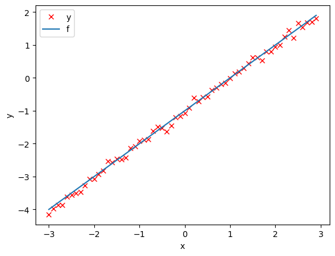
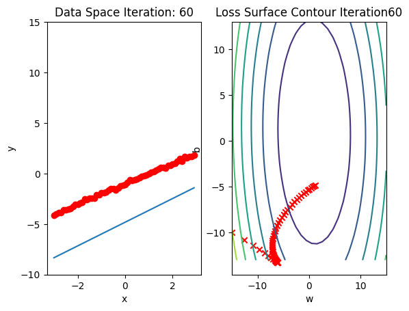
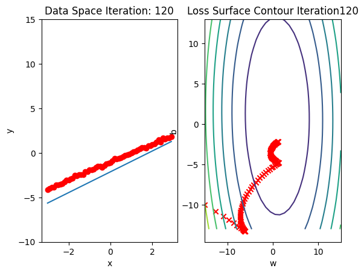
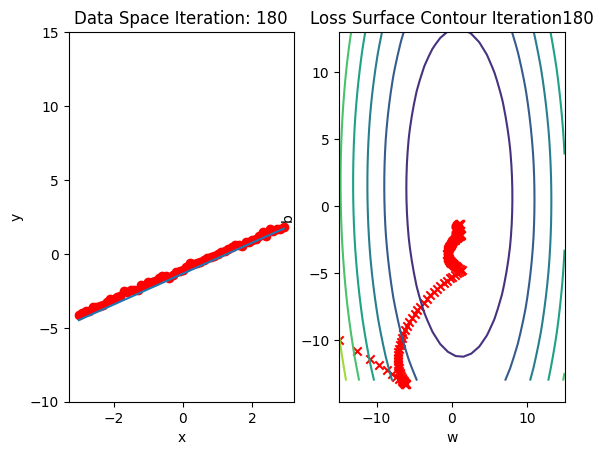
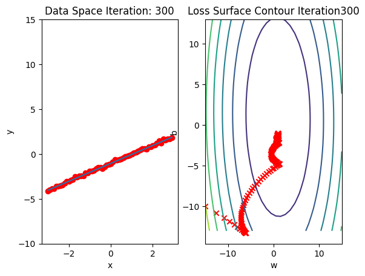
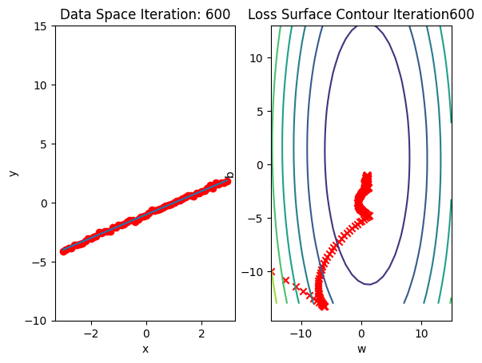

<h2>Linear Regression 1D: Training Two Parameter Mini-Batch Gradient Descent </h2> 


<h2>Objective</h2><ul class="cursored-list"><li><i class="bi bi-cursor"></i>     How to use PyTorch build-in functions to create a model.</li></ul> 


<h2>Table of Contents</h2>
<p>In this lab, you will create a model the PyTroch way, this will help you as models get more complicated</p>

<ul>
    <li><a href="#Makeup_Data"><i class="bi bi-cursor"></i> Make Some Data </a></li>
    <li><a href="#Model_Cost"><i class="bi bi-cursor"></i> Create the Model and Cost Function the PyTorch way </a></li>
    <li><a href="#BGD"><i class="bi bi-cursor"></i> Train the Model: Batch Gradient Descent</a></li>
</ul>

<p>Estimated Time Needed: <strong>30 min</strong></p>

<hr>


<!-- Newsletter -->
<div class="newsletter">
<div class="newsletter-heading">
<h4><i class="bi bi-info-circle-fill"></i> Don't Miss Any Updates!</h4>
</div>
<div class="newsletter-body">
<p>
Before we continue, I have a humble request, to be among the first to hear about future updates of the course materials, simply enter your email below, follow us on <a href="https://x.com/dataideaorg"><i class="bi bi-twitter-x"></i>
(formally Twitter)</a>, or subscribe to our <a href="https://www.youtube.com/@dataidea-science"><i class="bi bi-youtube"></i> YouTube channel</a>.
</p>
<iframe class="newsletter-frame" src="https://embeds.beehiiv.com/5fc7c425-9c7e-4e08-a514-ad6c22beee74?slim=true" data-test-id="beehiiv-embed" height="52" frameborder="0" scrolling="no">
</iframe>
</div>
</div>

<h2>Preparation</h2>


We'll need the following libraries:  


```python
# These are the libraries we are going to use in the lab.

import numpy as np
import matplotlib.pyplot as plt
from mpl_toolkits import mplot3d
from dataidea_science.plots import plot_error_surfaces
```

The class <code>plot_error_surfaces</code> is just to help you visualize the data space and the parameter space during training and has nothing to do with PyTorch. 


<!--Empty Space for separating topics-->


<h2 id="Makeup_Data">Make Some Data</h2>


Import libraries and set random seed.


```python
# Import libraries and set random seed

import torch
from torch.utils.data import Dataset, DataLoader
torch.manual_seed(1)
```


    <torch._C.Generator at 0x7f5c8438a2b0>


Generate values from -3 to 3 that create a line with a slope of 1 and a bias of -1. This is the line that you need to estimate. Add some noise to the data:


```python
# Create Data Class

class Data(Dataset):
    
    # Constructor
    def __init__(self):
        self.x = torch.arange(-3, 3, 0.1).view(-1, 1)
        self.f = 1 * self.x - 1
        self.y = self.f + 0.1 * torch.randn(self.x.size())
        self.len = self.x.shape[0]
        
    # Getter
    def __getitem__(self,index):    
        return self.x[index],self.y[index]
    
    # Get Length
    def __len__(self):
        return self.len
```

Create a dataset object: 


```python
# Create dataset object

dataset = Data()
```

Plot out the data and the line.


```python
# Plot the data

plt.plot(dataset.x.numpy(), dataset.y.numpy(), 'rx', label = 'y')
plt.plot(dataset.x.numpy(), dataset.f.numpy(), label = 'f')
plt.xlabel('x')
plt.ylabel('y')
plt.legend()
```


    <matplotlib.legend.Legend at 0x7f5c615e7d40>


    

    


<!--Empty Space for separating topics-->


<h2 id="Model_Cost">Create the Model and Total Loss Function (Cost)</h2>


Create a linear regression class 


```python
# Create a linear regression model class

from torch import nn, optim

class linear_regression(nn.Module):
    
    # Constructor
    def __init__(self, input_size, output_size):
        super(linear_regression, self).__init__()
        self.linear = nn.Linear(input_size, output_size)
        
    # Prediction
    def forward(self, x):
        yhat = self.linear(x)
        return yhat
```

**Note about the `super()` method**:
- When `LinearRegression` is instantiated, its `__init__` method is called.
- Inside `LinearRegression.__init__`, `super(LinearRegression, self).__init__()` calls the `__init__` method of the parent class (`nn.Module`).
- After the parent class is initialized, the rest of the code in the `LinearRegression.__init__` method runs too.

This mechanism ensures that the `nn.Module` class is properly initialized before any additional initialization specific to `LinearRegression` occurs.

## The Loss and Optimizer Functions

We will use PyTorch build-in functions to create a criterion function; this calculates the total loss or cost 


```python
# Build in cost function

criterion = nn.MSELoss()
```

Create a linear regression object and optimizer object, the optimizer object will use the linear regression object.


```python
# Create optimizer

model = linear_regression(1,1)
optimizer = optim.SGD(model.parameters(), lr = 0.01)
```


```python
list(model.parameters())
```


    [Parameter containing:
     tensor([[0.3636]], requires_grad=True),
     Parameter containing:
     tensor([0.4957], requires_grad=True)]


Remember to construct an optimizer you have to give it an iterable containing the parameters i.e. provide <code> model.parameters()</code> as an input to the object constructor 


Similar to the model, the optimizer has a state dictionary:


```python
optimizer.state_dict()
```


    {'state': {},
     'param_groups': [{'lr': 0.01,
       'momentum': 0,
       'dampening': 0,
       'weight_decay': 0,
       'nesterov': False,
       'maximize': False,
       'foreach': None,
       'differentiable': False,
       'fused': None,
       'params': [0, 1]}]}


Many of the keys correspond to more advanced optimizers.


Create a <code>Dataloader</code> object: 


```python
# Create Dataloader object

trainloader = DataLoader(dataset = dataset, batch_size = 1)
```

PyTorch randomly initialises your model parameters. If we use those parameters, the result will not be very insightful as convergence will be extremely fast. So we will initialise the parameters such that they will take longer to converge, i.e. look cool  


```python
# Customize the weight and bias

model.state_dict()['linear.weight'][0] = -15
model.state_dict()['linear.bias'][0] = -10
```

Create a plotting object, not part of PyTroch, just used to help visualize 


```python
# Create plot surface object

get_surface = plot_error_surfaces(15, 13, dataset.x, dataset.y, 30, go = False)
```

<!--Empty Space for separating topics-->


<h2 id="BGD">Train the Model via Batch Gradient Descent</h2>


Run 10 epochs of stochastic gradient descent: <b>bug</b> data space is 1 iteration ahead of parameter space. 


```python
# Train Model

def train_model_BGD(iter):
    for epoch in range(iter):
        for x,y in trainloader:
            yhat = model(x)
            loss = criterion(yhat, y)
            get_surface.set_para_loss(model, loss.tolist())          
            optimizer.zero_grad()
            loss.backward()

            optimizer.step()
        get_surface.plot_ps()


train_model_BGD(10)
```


    

    


    

    


    

    


    

    


    

    


    

    


    

    


    

    


    

    


    

    


```python
model.state_dict()
```


    OrderedDict([('linear.weight', tensor([[0.9932]])),
                 ('linear.bias', tensor([-1.0174]))])


Let's use the following diagram to help clarify the process. The model takes <code>x</code> to produce an estimate <code>yhat</code>, it will then be compared to the actual <code>y</code>  with the loss function.


When we call <code>backward()</code> on the loss function, it will handle the differentiation. Calling the method step on the optimizer object it will update the parameters as they were inputs when we constructed the optimizer object. The connection is shown in the following figure :


<!--Empty Space for separating topics-->


<h3>Practice</h3>


Try to train the model via BGD with <code>lr = 0.1</code>. Use <code>optimizer</code> and the following given variables.


```python
# Practice: Train the model via BGD using optimizer

model = linear_regression(1,1)
model.state_dict()['linear.weight'][0] = -15
model.state_dict()['linear.bias'][0] = -10
get_surface = plot_error_surfaces(15, 13, dataset.x, dataset.y, 30, go = False)
```

Double-click <b>here</b> for the solution.

<!-- 
optimizer = optim.SGD(model.parameters(), lr = 0.1)
trainloader = DataLoader(dataset = dataset, batch_size = 1)

def my_train_model(iter):
    for epoch in range(iter):
        for x,y in trainloader:
            yhat = model(x)
            loss = criterion(yhat, y)
            get_surface.set_para_loss(model, loss.tolist()) 
            optimizer.zero_grad()
            loss.backward()
            optimizer.step()
        get_surface.plot_ps()

train_model_BGD(10)
-->


## About the Author:

Hi, My name is Juma Shafara. Am a Data Scientist and Instructor at DATAIDEA. I have taught hundreds of peope Programming, Data Analysis and Machine Learning.

I also enjoy developing innovative algorithms and models that can drive insights and value.

I regularly share some content that I find useful throughout my learning/teaching journey to simplify concepts in Machine Learning, Mathematics, Programming, and related topics on my website [jumashafara.dataidea.org](https://jumashafara.dataidea.org).

Besides these technical stuff, I enjoy watching soccer, movies and reading mystery books.


<h2>What's on your mind? Put it in the comments!</h2>
<script src="https://utteranc.es/client.js"
        repo="dataideaorg/dataidea-science"
        issue-term="pathname"
        theme="github-light"
        crossorigin="anonymous"
        async>
</script>

