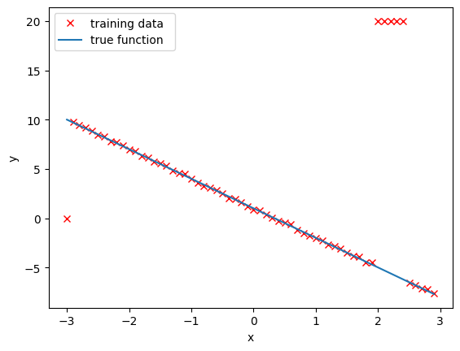
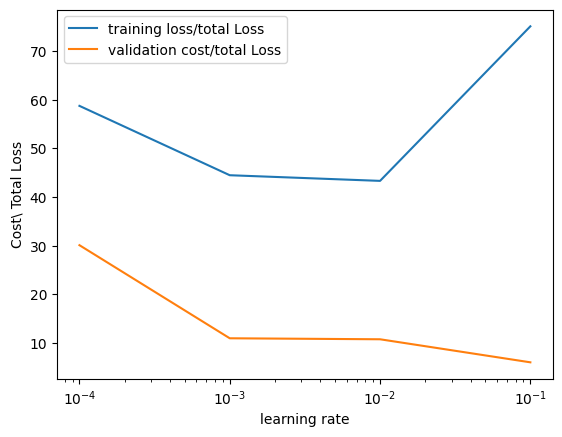
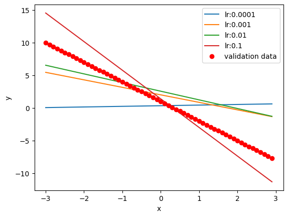

<h2>Linear regression: Training and Validation Data</h2> 

<h2>Objective</h2><ul class="cursored-list"><li><i class="bi bi-cursor"></i> How to use learning rate hyperparameter to improve your model result.</li></ul> 


<h2>Table of Contents</h2>
<p>In this lab, you will learn to select the best learning rate by using validation data.</p>

<ul class="cursored-list">
    <li><a href="#Makeup_Data"><i class="bi bi-cursor"></i> Make Some Data</a></li>
    <li><a href="#LR_Loader_Cost"><i class="bi bi-cursor"></i> Create a Linear Regression Object, Data Loader and Criterion Function</a></li>
    <li><a href="#LR_Hyper"><i class="bi bi-cursor"></i> Different learning rates and Data Structures to Store results for Different Hyperparameters</a></li>
    <li><a href="#Model"><i class="bi bi-cursor"></i> Train different modules for different Hyperparameters</a></li>
    <li><a href="#Result"><i class="bi bi-cursor"></i> View Results</a></li>
</ul>

<p>Estimated Time Needed: <strong>30 min</strong></p>

<hr>


<!-- Newsletter -->
<div class="newsletter">
<div class="newsletter-heading">
<h4><i class="bi bi-info-circle-fill"></i> Don't Miss Any Updates!</h4>
</div>
<div class="newsletter-body">
<p>
Before we continue, I have a humble request, to be among the first to hear about future updates of the course materials, simply enter your email below, follow us on <a href="https://x.com/dataideaorg"><i class="bi bi-twitter-x"></i>
(formally Twitter)</a>, or subscribe to our <a href="https://www.youtube.com/@dataidea-science"><i class="bi bi-youtube"></i> YouTube channel</a>.
</p>
<iframe class="newsletter-frame" src="https://embeds.beehiiv.com/5fc7c425-9c7e-4e08-a514-ad6c22beee74?slim=true" data-test-id="beehiiv-embed" height="52" frameborder="0" scrolling="no">
</iframe>
</div>
</div>

<h2>Preparation</h2>


We'll need the following libraries and set the random seed.


```python
# Import libraries we need for this lab, and set the random seed

from torch import nn
import torch
import numpy as np
import matplotlib.pyplot as plt
from torch import nn,optim
```

<!--Empty Space for separating topics-->


<h2 id="Makeup_Data">Make Some Data</h2>


First, we'll create some artificial data in a dataset class. The class will include the option to produce training data or validation data. The training data will include outliers.


```python
# Create Data class

from torch.utils.data import Dataset, DataLoader

class Data(Dataset):
    
    # Constructor
    def __init__(self, train = True):
            self.x = torch.arange(-3, 3, 0.1).view(-1, 1)
            self.f = -3 * self.x + 1
            self.y = self.f + 0.1 * torch.randn(self.x.size())
            self.len = self.x.shape[0]
            
            #outliers 
            if train == True:
                self.y[0] = 0
                self.y[50:55] = 20
            else:
                pass
      
    # Getter
    def __getitem__(self, index):    
        return self.x[index], self.y[index]
    
    # Get Length
    def __len__(self):
        return self.len
```

Create two objects: one that contains training data and a second that contains validation data. Assume that the training data has the outliers. 


```python
# Create training dataset and validation dataset

train_data = Data()
val_data = Data(train = False)
```

Overlay the training points in red over the function that generated the data. Notice the outliers at x=-3 and around x=2:


```python
# Plot out training points

plt.plot(train_data.x.numpy(), train_data.y.numpy(), 'xr',label="training data ")
plt.plot(train_data.x.numpy(), train_data.f.numpy(),label="true function  ")
plt.xlabel('x')
plt.ylabel('y')
plt.legend()
plt.show()
```


    

    


<!--Empty Space for separating topics-->


<h2 id="LR_Loader_Cost">Create a Linear Regression Object,  Data Loader, and Criterion Function</h2>


```python
# Create Linear Regression Class

from torch import nn

class linear_regression(nn.Module):
    
    # Constructor
    def __init__(self, input_size, output_size):
        super(linear_regression, self).__init__()
        self.linear = nn.Linear(input_size, output_size)
    
    # Prediction function
    def forward(self, x):
        yhat = self.linear(x)
        return yhat
```

Create the criterion function and a <code>DataLoader</code> object: 


```python
# Create MSELoss function and DataLoader

criterion = nn.MSELoss()
trainloader = DataLoader(dataset = train_data, batch_size = 1)
```

<!--Empty Space for separating topics-->


<h2 id="LR_Hyper">Different learning rates and Data Structures to Store results for different Hyperparameters</h2>


Create a list with different learning rates and a tensor (can be a list) for the training and validating cost/total loss. Include the list MODELS, which stores the training model for every value of the learning rate. 


```python
# Create Learning Rate list, the error lists and the MODELS list

learning_rates=[0.0001, 0.001, 0.01, 0.1]

train_error=torch.zeros(len(learning_rates))
validation_error=torch.zeros(len(learning_rates))

MODELS=[]
```

<!--Empty Space for separating topics-->


<h2 id="Model">Train different models  for different Hyperparameters</h2>


Try different values of learning rates, perform stochastic gradient descent, and save the results on the training data and validation data. Finally, save each model in a list.


```python
# Define the train model function and train the model

def train_model_with_lr (iter, lr_list):
    
    # iterate through different learning rates 
    for i, lr in enumerate(lr_list):
        model = linear_regression(1, 1)
        optimizer = optim.SGD(model.parameters(), lr = lr)
        for epoch in range(iter):
            for x, y in trainloader:
                yhat = model(x)
                loss = criterion(yhat, y)
                optimizer.zero_grad()
                loss.backward()
                optimizer.step()
                
        # train data
        Yhat = model(train_data.x)
        train_loss = criterion(Yhat, train_data.y)
        train_error[i] = train_loss.item()
    
        # validation data
        Yhat = model(val_data.x)
        val_loss = criterion(Yhat, val_data.y)
        validation_error[i] = val_loss.item()
        MODELS.append(model)

train_model_with_lr(10, learning_rates)
```

<!--Empty Space for separating topics-->


<h2 id="Result">View the Results</h2>


Plot the training loss and validation loss for each learning rate:  


```python
# Plot the training loss and validation loss

plt.semilogx(np.array(learning_rates), train_error.numpy(), label = 'training loss/total Loss')
plt.semilogx(np.array(learning_rates), validation_error.numpy(), label = 'validation cost/total Loss')
plt.ylabel('Cost\ Total Loss')
plt.xlabel('learning rate')
plt.legend()
plt.show()
```

    <>:5: SyntaxWarning: invalid escape sequence '\ '
    <>:5: SyntaxWarning: invalid escape sequence '\ '
    /tmp/ipykernel_80257/980418342.py:5: SyntaxWarning: invalid escape sequence '\ '
      plt.ylabel('Cost\ Total Loss')


    

    


Produce a prediction by using the validation data for each model:  


```python
# Plot the predictions

i = 0
for model, learning_rate in zip(MODELS, learning_rates):
    yhat = model(val_data.x)
    plt.plot(val_data.x.numpy(), yhat.detach().numpy(), label = 'lr:' + str(learning_rate))
    print('i', yhat.detach().numpy()[0:3])
plt.plot(val_data.x.numpy(), val_data.f.numpy(), 'or', label = 'validation data')
plt.xlabel('x')
plt.ylabel('y')
plt.legend()
plt.show()
```

    i [[0.05840436]
     [0.06799743]
     [0.0775905 ]]
    i [[5.4587383]
     [5.343816 ]
     [5.2288933]]
    i [[6.5484743]
     [6.4158573]
     [6.28324  ]]
    i [[14.55032  ]
     [14.1119585]
     [13.673596 ]]


    

    


<!--Empty Space for separating topics-->


<h3>Practice</h3>


The object <code>good_model</code> is the best performing model. Use the train loader to get the data samples x and y. Produce an estimate for <code>yhat</code> and print it out for every sample in a for a loop. Compare it to the actual prediction <code>y</code>.


Double-click <b>here</b> for the solution.

<!-- 
for x, y in trainloader:
    print("yhat= ", good_model(x),"y", y)
-->


## About the Author:

Hi, My name is Juma Shafara. Am a Data Scientist and Instructor at DATAIDEA. I have taught hundreds of peope Programming, Data Analysis and Machine Learning.

I also enjoy developing innovative algorithms and models that can drive insights and value.

I regularly share some content that I find useful throughout my learning/teaching journey to simplify concepts in Machine Learning, Mathematics, Programming, and related topics on my website [jumashafara.dataidea.org](https://jumashafara.dataidea.org).

Besides these technical stuff, I enjoy watching soccer, movies and reading mystery books.


<h2>What's on your mind? Put it in the comments!</h2>
<script src="https://utteranc.es/client.js"
        repo="dataideaorg/dataidea-science"
        issue-term="pathname"
        theme="github-light"
        crossorigin="anonymous"
        async>
</script>

