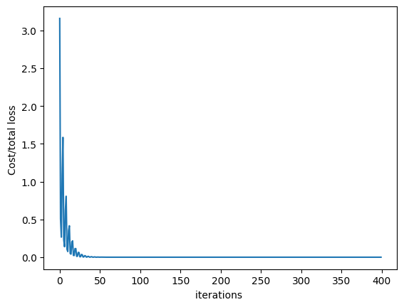

<h2>Objective</h2><ul class="cursored-list"><li><i class="bi bi-cursor"></i> How to create a complicated models using pytorch build in functions.</li></ul> 


<h2>Table of Contents</h2>
In this lab, you will create a model the Pytroch way. This will help you as models get more complicated.

<ul class="cursored-list" style="margin-top: 20px">
<li><a href="#ref0"><i class="bi bi-cursor"></i> Make Some Data</a></li>
<li><a href="#ref1"><i class="bi bi-cursor"></i> Create the Model and Cost Function the Pytorch way</a></li>
<li><a href="#ref2"><i class="bi bi-cursor"></i> Train the Model: Batch Gradient Descent</a></li>
<li><a href="#ref3"><i class="bi bi-cursor"></i> Practice Questions </a></li>
<br>
<p></p>
Estimated Time Needed: <strong>20 min</strong>
</ul>

<hr>


Import the following libraries:  


```python
import torch
import numpy as np
import matplotlib.pyplot as plt
from torch import nn,optim
from mpl_toolkits.mplot3d import Axes3D
from torch.utils.data import Dataset, DataLoader
import torchvision.transforms as transforms
```

Set the random seed:


```python
torch.manual_seed(1)
```


    <torch._C.Generator at 0x7fa794177110>


<a id="ref0"></a>
<h2>Make Some Data </h2>
Create a dataset class with two-dimensional features and two targets: 


```python
from torch.utils.data import Dataset, DataLoader
class Data(Dataset):
    def __init__(self):
            self.x=torch.zeros(20,2)
            self.x[:,0]=torch.arange(-1,1,0.1)
            self.x[:,1]=torch.arange(-1,1,0.1)
            self.w=torch.tensor([ [1.0,-1.0],[1.0,3.0]])
            self.b=torch.tensor([[1.0,-1.0]])
            self.f=torch.mm(self.x,self.w)+self.b
            
            self.y=self.f+0.001*torch.randn((self.x.shape[0],1))
            self.len=self.x.shape[0]

    def __getitem__(self,index):

        return self.x[index],self.y[index]
    
    def __len__(self):
        return self.len
```

create a dataset object 


```python
data_set=Data()
```

<a id="ref1"></a>
<h2>Create the Model, Optimizer, and Total Loss Function (cost)</h2>

Create a custom module:


```python
class linear_regression(nn.Module):
    def __init__(self,input_size,output_size):
        super(linear_regression,self).__init__()
        self.linear=nn.Linear(input_size,output_size)
    def forward(self,x):
        yhat=self.linear(x)
        return yhat
```


Create an optimizer object and set the learning rate to 0.1. **Don't forget to enter the model parameters in the constructor.**  


```python
model=linear_regression(2,2)
```

Create an optimizer object and set the learning rate to 0.1. **Don't forget to enter the model parameters in the constructor.**  


```python
optimizer = optim.SGD(model.parameters(), lr = 0.1)
```

Create the criterion function that calculates the total loss or cost:


```python
criterion = nn.MSELoss()
```

Create a data loader object and set the batch_size to 5:


```python
train_loader=DataLoader(dataset=data_set,batch_size=5)
```

<a id="ref2"></a>
<h2>Train the Model via Mini-Batch Gradient Descent </h2>

Run 100 epochs of Mini-Batch Gradient Descent and store the total loss or cost for every iteration. Remember that this is an approximation of the true total loss or cost.


```python
LOSS=[]
 
epochs=100
   
for epoch in range(epochs):
    for x,y in train_loader:
        #make a prediction 
        yhat=model(x)
        #calculate the loss
        loss=criterion(yhat,y)
        #store loss/cost 
        LOSS.append(loss.item())
        #clear gradient 
        optimizer.zero_grad()
        #Backward pass: compute gradient of the loss with respect to all the learnable parameters
        loss.backward()
        #the step function on an Optimizer makes an update to its parameters
        optimizer.step()
```

Plot the cost:


```python
plt.plot(LOSS)
plt.xlabel("iterations ")
plt.ylabel("Cost/total loss ")
plt.show()
```


    

    


## About the Author:

Hi, My name is Juma Shafara. Am a Data Scientist and Instructor at DATAIDEA. I have taught hundreds of peope Programming, Data Analysis and Machine Learning.

I also enjoy developing innovative algorithms and models that can drive insights and value.

I regularly share some content that I find useful throughout my learning/teaching journey to simplify concepts in Machine Learning, Mathematics, Programming, and related topics on my website [jumashafara.dataidea.org](https://jumashafara.dataidea.org).

Besides these technical stuff, I enjoy watching soccer, movies and reading mystery books.

<h2>What's on your mind? Put it in the comments!</h2>
<script src="https://utteranc.es/client.js"
        repo="dataideaorg/dataidea-science"
        issue-term="pathname"
        theme="github-light"
        crossorigin="anonymous"
        async>
</script>

