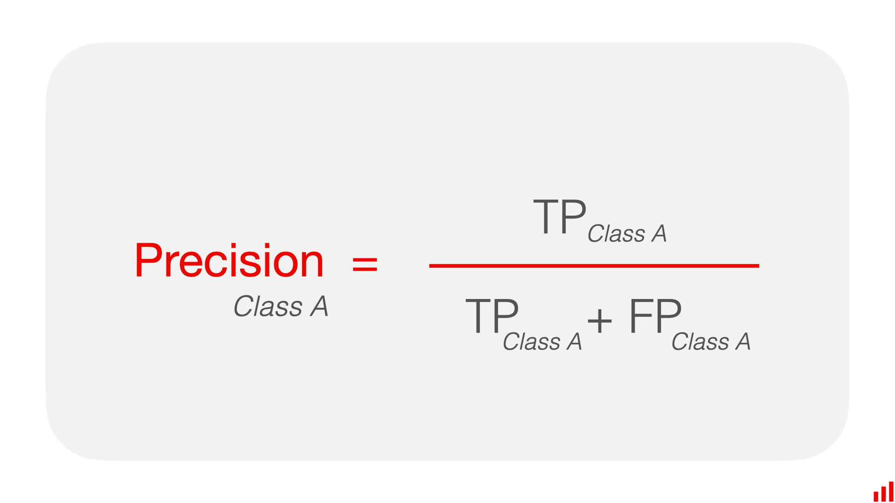
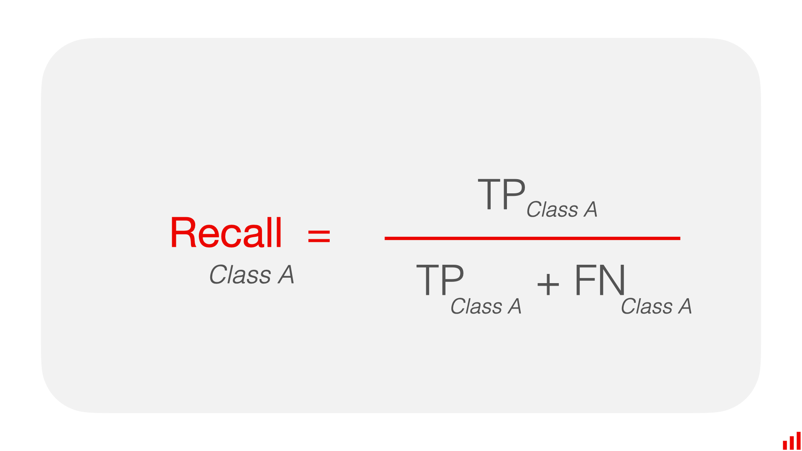
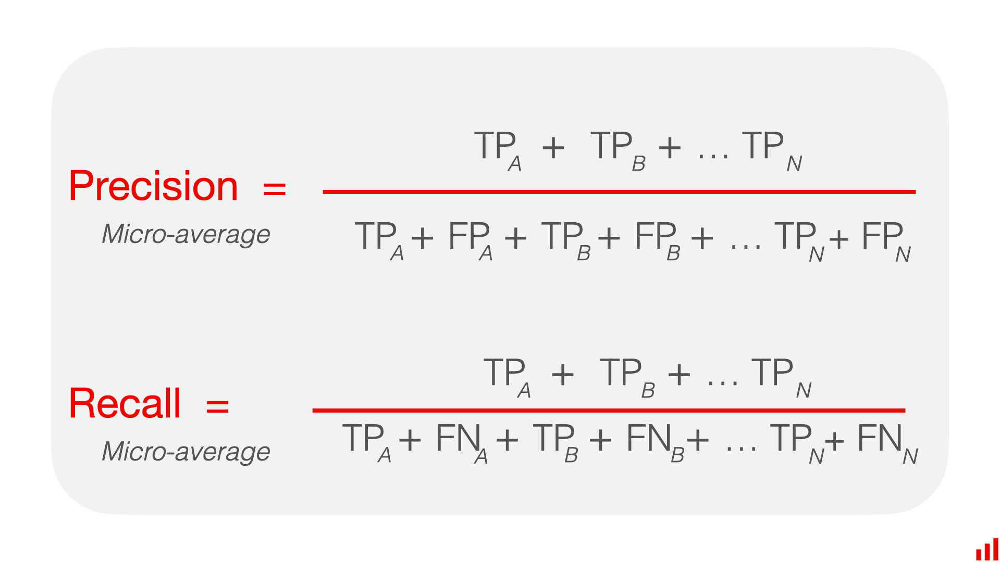
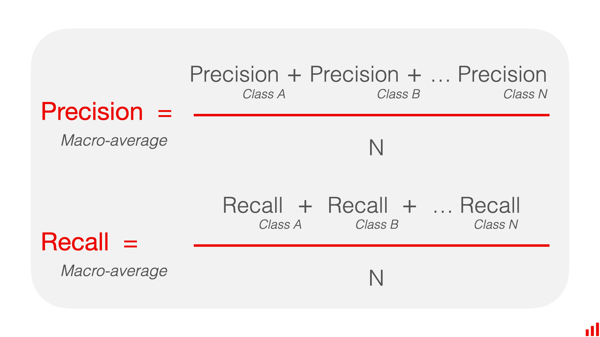

In scikit-learn, classification metrics are essential tools to evaluate the performance of a classification model. 

They provide insights into how well the model is performing and where it may need improvements. 

Here are some commonly used classification metrics along with examples of how to implement them using scikit-learn:


```python
import pandas as pd
```


```python
# True labels
y_true = [0, 1, 1, 0, 1]
# Predicted labels
y_pred = [1, 1, 0, 0, 1]
```

### Accuracy:
   - Accuracy measures the ratio of correctly predicted instances to the total instances.
   - Formula:

`Accuracy = Number of Correct Predictions / Total Number of Predictions`


<!-- Newsletter -->
<div class="newsletter">
<div class="newsletter-heading">
<h4><i class="bi bi-info-circle-fill"></i> Don't Miss Any Updates!</h4>
</div>
<div class="newsletter-body">
<p>
Before we continue, we have a humble request, to be among the first to hear about future updates of the course materials, simply enter your email below, follow us on <a href="https://x.com/dataideaorg"><i class="bi bi-twitter-x"></i>
(formally Twitter)</a>, or subscribe to our <a href="https://www.youtube.com/@dataidea-science"><i class="bi bi-youtube"></i> YouTube channel</a>.
</p>
<iframe class="newsletter-frame" src="https://embeds.beehiiv.com/5fc7c425-9c7e-4e08-a514-ad6c22beee74?slim=true" data-test-id="beehiiv-embed" height="52" frameborder="0" scrolling="no">
</iframe>
</div>
</div>


```python
from sklearn.metrics import accuracy_score

# Calculate accuracy
accuracy = accuracy_score(y_true=y_true, y_pred=y_pred)
print("Accuracy:", accuracy)
```

    Accuracy: 0.6


### Precision:
   - Precision measures the ability of the classifier not to label as positive a sample that is negative.
   - Precision is simply the models ability to not make a mistake
   - Formula:

`Precision = True Positives / (True Positives + False Positives)`




```python
from sklearn.metrics import precision_score

# Calculate precision
precision = precision_score(y_true, y_pred)
print("Precision:", precision)
```

    Precision: 0.6666666666666666


### Recall (also known as Sensitivity or True Positive Rate):
   - Recall measures the ability of the classifier to find all the positive samples.
   - Formula:

`Recall = True Positives / (True Positives + False Negatives)`




```python
from sklearn.metrics import recall_score

# Calculate recall
recall = recall_score(y_true, y_pred)
print("Recall:", recall)
```

    Recall: 0.6666666666666666


### F1 Score:
   - F1 Score is the harmonic mean of precision and recall. 
   - It provides a balance between precision and recall.
   - Formula:

`F1 Score = (2 x Precision x Recall) / (Precision + Recall)`


```python
from sklearn.metrics import f1_score

# Calculate F1 Score
f1 = f1_score(y_true, y_pred)
print("F1 Score:", f1)
```

    F1 Score: 0.6666666666666666


In classification tasks, metrics like precision, recall, and F1-score are commonly used to evaluate the performance of a model. When dealing with multi-class classification, you often need a way to aggregate these metrics across all classes. Three common methods for doing this are micro-average, macro-average, and weighted average.

### Micro-average:
   - Calculate metrics globally by counting the total true positives, false negatives, and false positives.
   - This method gives equal weight to each individual prediction, regardless of class imbalance.




```python
# Calculate micro-average
micro_precision = precision_score(y_true, y_pred, average='micro')
micro_recall = recall_score(y_true, y_pred, average='micro')
micro_f1 = f1_score(y_true, y_pred, average='micro')

print('Micro Precision:', micro_precision)
print('Micro Recall:', micro_recall)
print('Micro F1:', micro_f1)
```

    Micro Precision: 0.6
    Micro Recall: 0.6
    Micro F1: 0.6


### Macro-average:
   - Calculate metrics for each class individually and then average them.
   - This method treats all classes equally, giving each class the same weight.
   - To obtain macro-averaged precision, recall, and F1-score:
     - Calculate precision, recall, and F1-score for each class.
     - Average the precision, recall, and F1-score across all classes.




```python
# Calculate macro-average
macro_precision = precision_score(y_true, y_pred, average='macro')
macro_recall = recall_score(y_true, y_pred, average='macro')
macro_f1 = f1_score(y_true, y_pred, average='macro')

print('Macro Precision:', macro_precision)
print('Macro Recall:', macro_recall)
print('Macro F1:', macro_f1)
```

    Macro Precision: 0.5833333333333333
    Macro Recall: 0.5833333333333333
    Macro F1: 0.5833333333333333


### Weighted average:
   - Calculate metrics for each class individually and then average them, weighted by the number of true instances for each class.
   - This method considers class imbalance by giving more weight to classes with more instances.
   - To obtain weighted-averaged precision, recall, and F1-score:
     - Calculate precision, recall, and F1-score for each class.
     - Weighted average is calculated as the `sum of (metric * class_weight) / total_number_of_samples`, where class_weight is the ratio of the number of true instances in the given class to the total number of true instances.


```python
# Calculate weighted-average
weighted_precision = precision_score(y_true, y_pred, average='weighted')
weighted_recall = recall_score(y_true, y_pred, average='weighted')
weighted_f1 = f1_score(y_true, y_pred, average='weighted')

print('Weighted Precision:', weighted_precision)
print('Weighted Recall:', weighted_recall)
print('Weighted F1:', weighted_f1)
```

    Weighted Precision: 0.6
    Weighted Recall: 0.6
    Weighted F1: 0.6


Weighted_precision:

`(Precision_A * N_A + Precision_B * N_B, ... , Precision_n * N_n) / (N_A + N_B + ... + N_n)`

- Micro-average is useful when overall performance across all classes is important
- Macro-average is helpful when you want to evaluate the model's performance on smaller classes equally.
- Weighted average is suitable when you want to account for class imbalance.

### The Classification Report

The classification report in scikit-learn provides a comprehensive summary of different classification metrics for each class in the dataset. It includes precision, recall, F1-score, and support (the number of true instances for each label). Here's how you can generate a classification report:


```python
from sklearn.metrics import classification_report

# Generate classification report
class_report_dict = classification_report(y_true, y_pred, output_dict=True)
class_report_df = pd.DataFrame(class_report_dict).transpose()

print("Classification Report:\n")
class_report_df
```

    Classification Report:
    


<div>
<style scoped>
    .dataframe tbody tr th:only-of-type {
        vertical-align: middle;
    }

    .dataframe tbody tr th {
        vertical-align: top;
    }

    .dataframe thead th {
        text-align: right;
    }
</style>
<table border="1" class="dataframe">
  <thead>
    <tr style="text-align: right;">
      <th></th>
      <th>precision</th>
      <th>recall</th>
      <th>f1-score</th>
      <th>support</th>
    </tr>
  </thead>
  <tbody>
    <tr>
      <th>0</th>
      <td>0.500000</td>
      <td>0.500000</td>
      <td>0.500000</td>
      <td>2.0</td>
    </tr>
    <tr>
      <th>1</th>
      <td>0.666667</td>
      <td>0.666667</td>
      <td>0.666667</td>
      <td>3.0</td>
    </tr>
    <tr>
      <th>accuracy</th>
      <td>0.600000</td>
      <td>0.600000</td>
      <td>0.600000</td>
      <td>0.6</td>
    </tr>
    <tr>
      <th>macro avg</th>
      <td>0.583333</td>
      <td>0.583333</td>
      <td>0.583333</td>
      <td>5.0</td>
    </tr>
    <tr>
      <th>weighted avg</th>
      <td>0.600000</td>
      <td>0.600000</td>
      <td>0.600000</td>
      <td>5.0</td>
    </tr>
  </tbody>
</table>
</div>


```python
(0.666667 + 0.5)/2
```


    0.5833335


### Confusion Matrix:
   - A confusion matrix is a table that is often used to describe the performance of a classification model.
   - It presents a summary of the model's predictions on the classification problem, showing correct predictions as well as types of errors made.


```python
from sklearn.metrics import confusion_matrix
import pandas as pd

# Calculate confusion matrix
conf_matrix = confusion_matrix(y_true, y_pred)

conf_matrix = pd.DataFrame(conf_matrix, index=[1, 0], columns=[1, 0])
# print("Confusion Matrix:\n", conf_matrix)

conf_matrix
```


<div>
<style scoped>
    .dataframe tbody tr th:only-of-type {
        vertical-align: middle;
    }

    .dataframe tbody tr th {
        vertical-align: top;
    }

    .dataframe thead th {
        text-align: right;
    }
</style>
<table border="1" class="dataframe">
  <thead>
    <tr style="text-align: right;">
      <th></th>
      <th>1</th>
      <th>0</th>
    </tr>
  </thead>
  <tbody>
    <tr>
      <th>1</th>
      <td>1</td>
      <td>1</td>
    </tr>
    <tr>
      <th>0</th>
      <td>1</td>
      <td>2</td>
    </tr>
  </tbody>
</table>
</div>


These are just a few of the many classification metrics available in scikit-learn. Depending on your specific problem and requirements, you may want to explore other metrics as well.

Understanding these metrics and how they are computed can provide valuable insights into the performance of a classification model and help in making informed decisions about its improvement.

<h2>What's on your mind? Put it in the comments!</h2>
<script src="https://utteranc.es/client.js"
        repo="dataideaorg/dataidea-science"
        issue-term="pathname"
        theme="github-light"
        crossorigin="anonymous"
        async>
</script>
