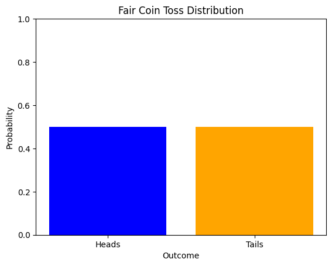
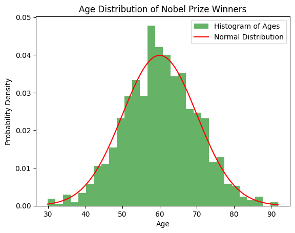
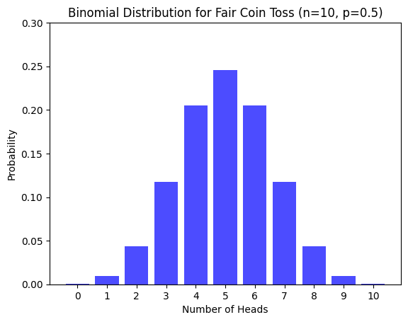
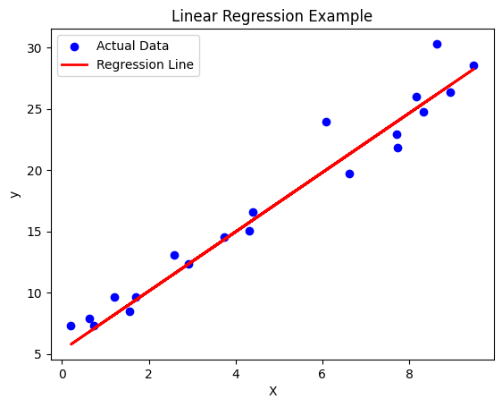

<div class="video-wrapper">
  <iframe
    class="video-iframe"
    src="https://www.youtube.com/embed/5GFMJ9HLFQU?si=oY-xb4-_E5oaOeXL"
    title="YouTube video player"
    frameborder="0"
    allow="accelerometer; autoplay; clipboard-write; encrypted-media; gyroscope; picture-in-picture;"
    allowfullscreen>
  </iframe>
</div>


```python
import numpy as np
import matplotlib.pyplot as plt
```

## Linear Algebra for Data Science

We'll cover essential linear algebra concepts, including **Vectors and Matrices** and **Matrix Operations**, with Python code examples using NumPy.

### 1. Vectors and Matrices

 **Vector:** A vector is an ordered list of numbers, which can be represented as a row or column.


```python
# Creating a vector
vector = np.array([3, 4])
print("Vector:", vector)
```

    Vector: [3 4]


**Matrix:** A matrix is a two-dimensional array of numbers.


```python
# Creating a matrix
matrix = np.array([[1, 2], [3, 4]])
print("Matrix:\n", matrix)
```

    Matrix:
     [[1 2]
     [3 4]]


**Applications of Vectors and Matrices**
  - Representing physical quantities like force, velocity, and acceleration
  - Describing geometric shapes and transformations
  - Organizing and modeling data in data science

### 2. Matrix Operations

**Addition and Subtraction**


```python
A = np.array([[1, 2], [3, 4]])
B = np.array([[5, 6], [7, 8]])

print("Matrix A:\n", A)
print("Matrix B:\n", B)
```

    Matrix A:
     [[1 2]
     [3 4]]
    Matrix B:
     [[5 6]
     [7 8]]


```python
# Element-wise addition
A = np.array([[1, 2], [3, 4]])
B = np.array([[5, 6], [7, 8]])

C = A + B
print("A + B:\n", C)
```

    A + B:
     [[ 6  8]
     [10 12]]


```python
# Element-wise subtraction
A = np.array([[1, 2], [3, 4]])
B = np.array([[5, 6], [7, 8]])

D = A - B
print("A - B:\n", D)
```

    A - B:
     [[-4 -4]
     [-4 -4]]


**Matrix Multiplication**


```python
# Element-wise multiplication
A = np.array([[1, 2], [3, 4]])
B = np.array([[5, 6], [7, 8]])

E = A * B
print("Element-wise A * B:\n", E)
```

    Element-wise A * B:
     [[ 5 12]
     [21 32]]


```python
# Dot product (Matrix multiplication)
A = np.array([[1, 2], [3, 4]])
B = np.array([[5, 6], [7, 8]])

F = np.dot(A, B)
print("Dot Product A @ B:\n", F)
```

    Dot Product A @ B:
     [[19 22]
     [43 50]]


```python
# **Transpose of a Matrix**
A = np.array([[1, 2], [3, 4]])

G = A.T
print("Transpose of A:\n", G)

```

    Transpose of A:
     [[1 3]
     [2 4]]


**Research:**

- Inverse Matrix
- Determinant
- Eigenvalues and Eigenvectors


## Derivatives and Gradients in Calculus

Derivatives measure the rate of change of a function. 


```python
from sympy import symbols, diff
```


```python
# Define symbol x for differentiation
x = symbols('x')
f = x**2 + 3*x + 2
# get derivative
f_derivative = diff(f, x)
print("Derivative of f(x) = x^2 + 3x + 2 is:", f_derivative)

```

    Derivative of f(x) = x^2 + 3x + 2 is: 2*x + 3


## Gradient

The gradient of a function represents the direction and rate of steepest increase of that function at any given point.

**Applications of Gradient**

- Optimization algorithms


## Probability Distributions
Probability distributions describe how values are distributed. 
Here, we explore some common ones: Uniform, Normal, Binomial.

### Uniform Distribution
In a uniform distribution, all values within a range are equally likely.


```python
import numpy as np
import matplotlib.pyplot as plt
import seaborn as sns
import scipy.stats as stats

```


```python

# Discrete uniform distribution for a fair coin (2 outcomes: heads or tails)
outcomes = ['Heads', 'Tails']
probabilities = [0.5, 0.5]

# Plotting
plt.bar(outcomes, probabilities, color=['blue', 'orange'])
plt.title('Fair Coin Toss Distribution')
plt.xlabel('Outcome')
plt.ylabel('Probability')
plt.ylim(0, 1)
plt.show()
```


    

    


**Examples of uniform distributions**

- Rolling a fair die
- Flipping a fair coin
- Drawing a card from a well-shuffled deck

### Normal Distribution

A normal (Gaussian) distribution is symmetric, centered around the mean.


```python
from scipy.stats import norm

# Simulating Nobel Prize winner ages (mean = 60, std dev = 10)
mu, sigma = 60, 10
ages = np.random.normal(mu, sigma, 1000)  # Generate 1000 random ages

# Plotting the histogram of ages
plt.hist(ages, bins=30, density=True, alpha=0.6, color='g', label='Histogram of Ages')

# Plot the normal distribution PDF
x = np.linspace(ages.min(), ages.max(), 100)
y = norm.pdf(x, mu, sigma)
plt.plot(x, y, 'r-', label='Normal Distribution')

plt.title('Age Distribution of Nobel Prize Winners')
plt.xlabel('Age')
plt.ylabel('Probability Density')
plt.legend()
plt.show()
```


    

    


**Examples of normal distributions**

- Heights of people
- IQ scores
- Measurement errors
- Stock price fluctuations

### Binomial Distribution

The binomial distribution models the number of successes in `n` trials.


```python
from scipy.stats import binom

# Parameters
n, p = 10, 0.5  # Number of trials and probability of success (fair coin)
x = np.arange(0, n + 1)  # Possible number of heads (successes)
y = binom.pmf(x, n, p)  # Binomial PMF (probability mass function)

# Plotting the binomial distribution
plt.bar(x, y, color='blue', alpha=0.7)
plt.title('Binomial Distribution for Fair Coin Toss (n=10, p=0.5)')
plt.xlabel('Number of Heads')
plt.ylabel('Probability')
plt.xticks(np.arange(0, n + 1))
plt.ylim(0, 0.3)  # Limiting y-axis for better visualization
plt.show()
```


    

    


**Examples of binomial distributions**

- Number of heads in coin flips
- Number of defective items in a batch
- Number of customers who click on an ad
- Number of students who pass an exam


## Expectation and Variance

Expectation (mean) of a random variable X is E[X] = Σ x * P(x)

Variance measures spread: Var(X) = E[X^2] - (E[X])^2


```python
# Example with a discrete random variable
values = np.array([1, 2, 3, 4, 5])
probs = np.array([0.1, 0.2, 0.3, 0.2, 0.2])  # Probabilities sum to 1
expectation = np.sum(values * probs)
variance = np.sum((values**2) * probs) - expectation**2
print(f"Expectation (E[X]): {expectation}")
print(f"Variance (Var[X]): {variance}")

# For a normal distribution
mean, std_dev = 5, 2
expectation_norm = mean
variance_norm = std_dev ** 2
print(f"Normal Distribution - Expectation: {expectation_norm}, Variance: {variance_norm}")
```

    Expectation (E[X]): 3.2
    Variance (Var[X]): 1.5599999999999987
    Normal Distribution - Expectation: 5, Variance: 4


**Applications of Expectation and Variance**

- Portfolio management
- Insurance risk assessment
- Machine Learning model performance
- Hypothesis testing


### Statistics in Data Science

This notebook covers Descriptive Statistics and Regression Analysis with examples in Python.


```python
import numpy as np
import pandas as pd
import matplotlib.pyplot as plt
import seaborn as sns
from scipy import stats
from sklearn.linear_model import LinearRegression
from sklearn.model_selection import train_test_split
from sklearn.metrics import mean_squared_error, r2_score
```

## Descriptive Statistics


```python
# Descriptive Statistics
data = [12, 15, 14, 10, 8, 10, 12, 15, 18, 20, 20, 21, 19, 18]
print(f"Dataset: {data}")

mean_value = np.mean(data)
median_value = np.median(data)
mode_value = stats.mode(data).mode
std_dev = np.std(data)

print(f"Mean: {mean_value}")
print(f"Median: {median_value}")
print(f"Mode: {mode_value}")
print(f"Standard Deviation: {std_dev}")
```

    Dataset: [12, 15, 14, 10, 8, 10, 12, 15, 18, 20, 20, 21, 19, 18]
    Mean: 15.142857142857142
    Median: 15.0
    Mode: 10
    Standard Deviation: 4.120630029101703


## Regression Analysis


```python
# Regression Analysis
np.random.seed(42)
X = np.random.rand(100, 1) * 10  # Independent variable
y = 2.5 * X + np.random.randn(100, 1) * 2 + 5  # Dependent variable with noise
# Splitting the data
X_train, X_test, y_train, y_test = train_test_split(X, y, test_size=0.2, random_state=42)

# Applying Linear Regression
model = LinearRegression()
model.fit(X_train, y_train)
y_pred = model.predict(X_test)

# Model Performance
print(f"Intercept: {model.intercept_[0]}")
print(f"Slope: {model.coef_[0][0]}")
print(f"Mean Squared Error: {mean_squared_error(y_test, y_pred)}")
print(f"R-squared Score: {r2_score(y_test, y_pred)}")

# Plotting the Regression Line
plt.scatter(X_test, y_test, color='blue', label='Actual Data')
plt.plot(X_test, y_pred, color='red', linewidth=2, label='Regression Line')
plt.title("Linear Regression Example")
plt.xlabel("X")
plt.ylabel("y")
plt.legend()
plt.show()

```

    Intercept: 5.285826638917127
    Slope: 2.419729462992111
    Mean Squared Error: 2.6147980548680128
    R-squared Score: 0.9545718935323326


    

    


**Applications of Regression Analysis**

- Predictive modeling
- Time series forecasting
- Causal inference
- Feature engineering
