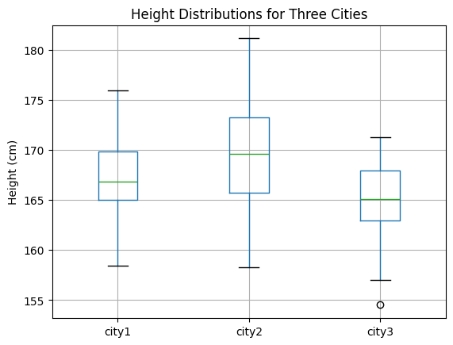

## Hypothesis Testing Tutorial

**Objective**: This tutorial introduces hypothesis testing, one of the key statistical concepts used to make decisions based on data. We will use **Python** and the **SciPy** library to conduct hypothesis testing.

<!-- Newsletter -->
<div class="newsletter">
<div class="newsletter-heading">
<h4><i class="bi bi-info-circle-fill"></i> Don't Miss Any Updates!</h4>
</div>
<div class="newsletter-body">
<p>
Before we continue, we have a humble request, to be among the first to hear about future updates of the course materials, simply enter your email below, follow us on <a href="https://x.com/dataideaorg"><i class="bi bi-twitter-x"></i>
(formally Twitter)</a>, or subscribe to our <a href="https://www.youtube.com/@dataidea-science"><i class="bi bi-youtube"></i> YouTube channel</a>.
</p>
<iframe class="newsletter-frame" src="https://embeds.beehiiv.com/5fc7c425-9c7e-4e08-a514-ad6c22beee74?slim=true" data-test-id="beehiiv-embed" height="52" frameborder="0" scrolling="no">
</iframe>
</div>
</div>

## 1. What is Hypothesis Testing?
**Hypothesis Testing** is a statistical method used to make decisions or inferences about a population parameter based on sample data. It helps determine if there is enough evidence to reject a null hypothesis in favor of an alternative hypothesis.

## 2. Types of Hypotheses
1. **Null Hypothesis (H₀)**: This is the default assumption that there is no effect or no difference. For example, "There is no difference in mean height between men and women."
2. **Alternative Hypothesis (H₁)**: This opposes the null hypothesis, stating that there is an effect or difference. For example, "There is a difference in mean height between men and women."

## 3. Steps in Hypothesis Testing
1. **Define Hypotheses**: Set the null and alternative hypotheses.
2. **Select Significance Level (α)**: The probability threshold (commonly 0.05) below which the null hypothesis is rejected.
3. **Choose the Test Statistic**: Based on the type of data and sample size, e.g., t-test, chi-square test.
4. **Compute p-value**: This is the probability of observing the data if the null hypothesis is true.
5. **Make a Decision**:
   - If p-value < α, reject the null hypothesis.
   - If p-value ≥ α, fail to reject the null hypothesis.

## 4. Common Hypothesis Tests
1. **One-sample t-test**: Tests whether the mean of a sample is significantly different from a known or hypothesized value.
2. **Two-sample t-test**: Compares the means of two independent samples.
3. **Chi-square test**: Tests for association between categorical variables.

## 5. Example: Hypothesis Testing in Python

### (a) Import Libraries


```python
import numpy as np
import pandas as pd
from scipy import stats
import matplotlib.pyplot as plt
```

### (b) One-sample t-test

**Scenario**: You want to test whether the average height of people in a town is 170 cm. You take a sample of 30 people and record their heights.


```python
# Sample data (heights of 30 people)
np.random.seed(42)  # For reproducibility
sample_heights = np.random.normal(168, 5, 30)  # mean=168, std=5

# Perform one-sample t-test
t_stat, p_value = stats.ttest_1samp(sample_heights, 170)

print(f"t-statistic: {t_stat:.4f}, p-value: {p_value:.4f}")

# Significance level
alpha = 0.05
if p_value < alpha:
    print("Reject the null hypothesis: The average height is not 170 cm.")
else:
    print("Fail to reject the null hypothesis: The average height is 170 cm.")
```

    t-statistic: -3.5793, p-value: 0.0012
    Reject the null hypothesis: The average height is not 170 cm.


### (c) Two-sample t-test

**Scenario**: You want to compare the average heights of men and women in the same town. You have the height data for 20 men and 20 women.


```python
# Heights of men and women (sample data)
np.random.seed(42)
men_heights = np.random.normal(175, 6, 20)
women_heights = np.random.normal(165, 5, 20)

# Perform two-sample t-test
t_stat, p_value = stats.ttest_ind(men_heights, women_heights)

print(f"t-statistic: {t_stat:.4f}, p-value: {p_value:.4f}")

# Decision
if p_value < alpha:
    print("Reject the null hypothesis: There is a significant difference between men's and women's heights.")
else:
    print("Fail to reject the null hypothesis: No significant difference in heights.")
```

    t-statistic: 6.1236, p-value: 0.0000
    Reject the null hypothesis: There is a significant difference between men's and women's heights.


### (d) Chi-square test

**Scenario**: You want to test whether gender and preference for a product (Yes/No) are independent in a survey.


```python
# Contingency table (sample data)
# Rows: Gender (Male, Female), Columns: Preference (Yes, No)
data = [[30, 10], [25, 15]]

# Perform chi-square test
chi2_stat, p_value, dof, expected = stats.chi2_contingency(data)

print(f"Chi-square statistic: {chi2_stat:.4f}, p-value: {p_value:.4f}")

# Decision
if p_value < alpha:
    print("Reject the null hypothesis: Gender and preference are not independent.")
else:
    print("Fail to reject the null hypothesis: Gender and preference are independent.")
```

    Chi-square statistic: 0.9309, p-value: 0.3346
    Fail to reject the null hypothesis: Gender and preference are independent.


### (e) ANOVA (Analysis of Variance)

**Scenario**: You want to compare the average heights of people from three different cities to see if there is a statistically significant difference in their means.

**Hypotheses**:
- **H₀** (Null Hypothesis): The means of all groups are equal.
- **H₁** (Alternative Hypothesis): At least one group has a different mean.


```python
# Simulate data for three cities (heights)
np.random.seed(42)
city1_heights = np.random.normal(168, 5, 30)
city2_heights = np.random.normal(170, 6, 30)
city3_heights = np.random.normal(165, 4, 30)

# Combine data into a pandas DataFrame
df = pd.DataFrame({
    'city1': city1_heights,
    'city2': city2_heights,
    'city3': city3_heights
})

# Visualize the data
df.boxplot()
plt.title('Height Distributions for Three Cities')
plt.ylabel('Height (cm)')
plt.show()

# Perform ANOVA test
f_stat, p_value = stats.f_oneway(city1_heights, city2_heights, city3_heights)

print(f"F-statistic: {f_stat:.4f}, p-value: {p_value:.4f}")

# Decision
alpha = 0.05
if p_value < alpha:
    print("Reject the null hypothesis: At least one city has a different mean height.")
else:
    print("Fail to reject the null hypothesis: All cities have the same mean height.")
```


    

    


    F-statistic: 5.9711, p-value: 0.0037
    Reject the null hypothesis: At least one city has a different mean height.


## Explanation of ANOVA
<i class="bi bi-cursor"></i> **F-statistic**: A ratio of the variance between the group means to the variance within the groups. A higher F-statistic indicates a greater disparity between group means.

## Conclusion
Congratulations on completing this tutorial. Hypothesis testing is a powerful statistical tool used to make data-driven decisions. This tutorial demonstrated how to conduct hypothesis testing in Python with the:
<ul class="cursored-list">
<li><i class="bi bi-cursor"></i> one-sample t-test</li> 
<li><i class="bi bi-cursor"></i> two-sample t-test</li> 
<li><i class="bi bi-cursor"></i> chi-square test</li> 
<li><i class="bi bi-cursor"></i> ANOVA</li> 
</ul>

<h2>What's on your mind? Put it in the comments!</h2>
<script src="https://utteranc.es/client.js"
        repo="dataideaorg/dataidea-science"
        issue-term="pathname"
        theme="github-light"
        crossorigin="anonymous"
        async>
</script>
