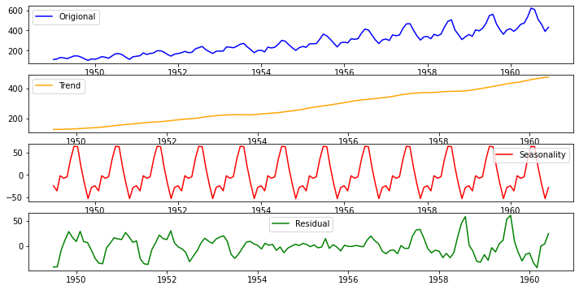
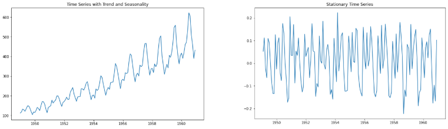
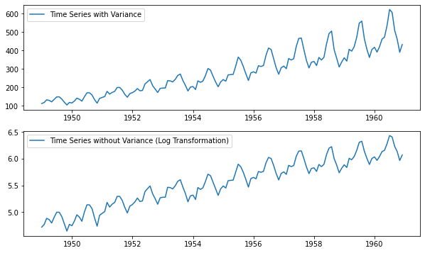
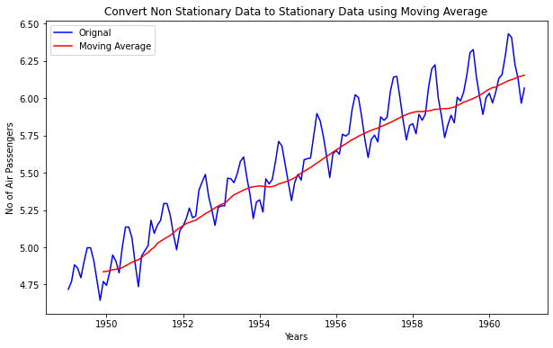

As name suggest its analysis of the time series data to identify the patterns in it. I will briefly explain the different techniques and test for time series data analysis.

<!-- Newsletter -->

<h4><i class="bi bi-info-circle-fill"></i> Don't Miss Any Updates!</h4>

Before we continue, I have a humble request, to be among the first to hear about future updates of the course materials, simply enter your email below, follow us on <a href="https://x.com/dataideaorg"><i class="bi bi-twitter-x"></i>
(formally Twitter)</a>, or subscribe to our <a href="https://www.youtube.com/@dataidea-science"><i class="bi bi-youtube"></i> YouTube channel</a>.

<iframe class="newsletter-frame" src="https://embeds.beehiiv.com/5fc7c425-9c7e-4e08-a514-ad6c22beee74?slim=true" data-test-id="beehiiv-embed" height="52" frameborder="0" scrolling="no">
</iframe>

## Air Passengers Data Set
We have a monthly time series data of the air passengers from 1 Jan 1949 to 1 Dec 1960. Each row contains the air passenger number for a month of that particular year. Objective is to build a model to forecast the air passenger traffic for future months.

## Decomposition of Time Series
Time series decomposition helps to deconstruct the time series into several component like trend and seasonality for better visualization of its characteristics. Using time-series decomposition makes it easier to quickly identify a changing mean or variation in the data

## Stationary Data
For accurate analysis and forecasting trend and seasonality is removed from the time series and converted it into stationary series.
Time series data is said to be stationary when statistical properties like mean, standard deviation are constant and there is no seasonality. In other words statistical properties of the time series data should not be a function of time.

## Test for Stationarity 
Easy way is to look at the plot and look for any obvious trend or seasonality. While working on real world data we can also use more sophisticated methods like rolling statistic and Augmented Dickey Fuller test to check stationarity of the data.

### Rolling Statistics 
In rolling statistics technique we define a size of window to calculate the mean and standard deviation throughout the series. For stationary series mean and standard deviation shouldn't change with time.

### Augmented Dickey Fuller (ADF) Test 
I won't go into the details of how this test works. I will concentrate more on how to interpret the result of this test to determine the stationarity of the series. ADF test will return 'p-value' and 'Test Statistics' output values.
* **p-value > 0.05**: non-stationary.
* **p-value <= 0.05**: stationary.
* **Test statistics**: More negative this value more likely we have stationary series. Also, this value should be smaller than critical values(1%, 5%, 10%). For e.g. If test statistic is smaller than the 5% critical values, then we can say with 95% confidence that this is a stationary series

## Convert Non-Stationary Data to Stationary Data 
Accounting for the time series data characteristics like trend and seasonality is called as making data stationary. So by making the mean and variance of the time series constant, we will get the stationary data. Below are the few technique used for the same…

### Differencing 
Differencing technique helps to remove the trend and seasonality from time series data. Differencing is performed by subtracting the previous observation from the current observation. The differenced data will contain one less data point than original data. So differencing actually reduces the number of observations and stabilize the mean of a time series.

$$d = t - t0$$

After performing the differencing it's recommended to plot the data and  visualize the change. In case there is not sufficient improvement you can perform second order or even third order differencing.

### Transformation 
A simple but often effective way to stabilize the variance across time is to apply a power transformation to the time series. Log, square root, cube root are most commonly used transformation techniques.
Most of the time you can pick the type of growth of the time series and accordingly choose the transformation method. For. e.g. A time series that has a quadratic growth trend can be made linear by taking the square root. In case differencing don't work, you may first want to use one of above transformation technique to remove the variation from the series. 

### Moving Average 
In moving averages technique, a new series is created by taking the averages of data points from original series. In this technique we can use two or more raw data points to calculate the average. This is also called as 'window width (w)'. Once window width is decided, averages are calculated from start to the end for each set of w consecutive values, hence the name moving averages. It can also be used for time series forecasting.

#### Weighted Moving Averages(WMA) 
WMA is a technical indicator that assigns a greater weighting to the most recent data points, and less weighting to data points in the distant past. The WMA is obtained by multiplying each number in the data set by a predetermined weight and summing up the resulting values. There can be many techniques for assigning weights. A popular one is exponentially weighted moving average where weights are assigned to all the previous values with a decay factor.

#### Centered Moving Averages(CMS) 
In a centered moving average, the value of the moving average at time t is computed by centering the window around time t and averaging across the w values within the window. For example, a center moving average with a window of 3 would be calculated as
  
  $$CMA(t) = mean(t-1, t, t+1)$$
  
  
CMA is very useful for visualizing the time series data

#### Trailing Moving Averages(TMA) 
In trailing moving average, instead of averaging over a window that is centered around a time period of interest, it simply takes the average of the last w values. For example, a trailing moving average with a window of 3 would be calculated as:

$$TMA(t) = mean(t-2, t-1, t)$$
 
 TMA are useful for forecasting.

## Correlation 
* Most important point about values in time series is its dependence on the previous values.
* We can calculate the correlation for time series observations with previous time steps, called as lags.
* Because the correlation of the time series observations is calculated with values of the same series at previous times, this is called an autocorrelation or serial correlation.
* To understand it better lets consider the example of fish prices. We will use below notation to represent the fish prices. 
    - $P(t)$= Fish price of today
    - $P(t-1)$ = Fish price of last month
    - $P(t-2)$ =Fish price of last to last month
* Time series of fish prices can be represented as $P(t-n),..... P(t-3), P(t-2),P(t-1), P(t)$
* So if we have fish prices for last few months then it will be easy for us to predict the fish price for today (Here we are ignoring all other external factors that may affect the fish prices)

All the past and future data points are related in time series and ACF and PACF functions help us to determine correlation in it.

### Auto Correlation Function (ACF) 
* ACF tells you how correlated points are with each other, based on how many time steps they are separated by.
* Now to understand it better lets consider above example of fish prices. Let's try to find the correlation between fish price for current month P(t) and two months ago P(t-2). Important thing to note that, fish price of two months ago can directly affect the today's fish price or it can indirectly affect the fish price through last months price P(t-1)
* So ACF consider the direct as well indirect effect between the points while determining the correlation

### Partial Auto Correlation Function (PACF) 
* Unlike ACF, PACF only consider the direct effect between the points while determining the correlation
* In case of above fish price example PACF will determine the correlation between fish price for current month P(t) and two months ago P(t-2) by considering only P(t) and P(t-2) and ignoring P(t-1)

<h2>What's on your mind? Put it in the comments!</h2>

